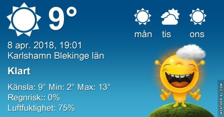
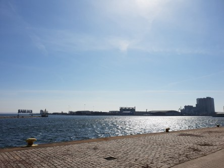
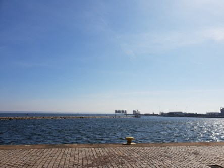

Idag går solen upp 06:13 och ned 19:52. Månen går upp 03:16 och ned 11:30 Månen är belyst 52 %. Dagens längd är 13 timmar och 39 minuter

 Halvklart -2,1 C   Vindstilla  Luftfuktighet 77 %  hPa 1009 Kl.02:05

 Tunna slöjmoln - 2,9 C  Vindstilla  Luftfuktighet 87 %  hPa 1008 Kl.06:50

 Tunna slöjmoln 16,9 C  Vindby 0, m/s NW  Luftfuktighet 45 %  hPa 1008 Kl.13:55

 Tunna slöjmoln 7,5 C  Vindby 0,3 m/s N  Luftfuktighet 61 %  hPa 1007 Kl.20:00

 Soligt och härligt varmt idag.

Högst och lägst uppmätta temperatur igår (inofficiellt privat mätare): Max 13,7 C , Min - 4 C Högst uppmätta vind 3,4 m/s. Högst uppmätta vindby 8 m/s.

Högst och lägst uppmätta temperatur igår (officiellt enligt [YR.NO](http://www.vackertvader.se/v%C3%A4derstation/karlshamn?utm_source=email&utm_medium=email&utm_campaign=asarum)) Max 8 C, Min – 2,8 C Högst uppmätta vind 4,6 m/s. Högst uppmätta vindby 9,2 m/s

 Efter en dag i Kalmar så får det bli lite bilder från hamnen och slottet där. Det var ordentligt blåsigt och riktigt kallt där.
