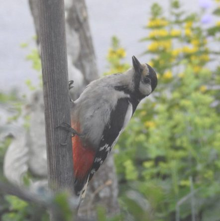
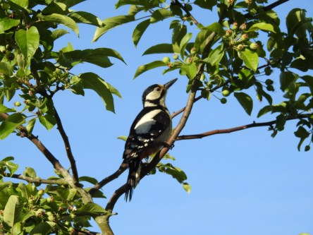
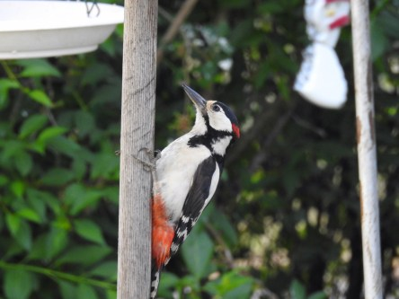

Idag går solen upp 04:15 och ned 21:44. Månen går upp 02:28 och ned 14:23 Månen är belyst 37 %. Dagens längd är 17 timmar och 29 minuter

 Klart 7 C  Vindstilla  Luftfuktighet 99 %  hPa 1012 Kl.02:10

 Tunna slöjmoln 19,8 C  Vindby 1,4 m/s W  Luftfuktighet 57 %  hPa 1011 Kl.07:30

 Klart 27,3 C  Vindby 2,7 m/s W  Luftfuktighet 33 %  hPa 1012 Kl.15:35

 Mest klart 19,1 C  Vindby 1,4 m/s NW  Luftfuktighet 64 %  hPa 1012 Kl.20:05

 Idag var värmen tillbaks med besked.

Högst och lägst uppmätta temperatur igår (inofficiellt privat mätare): Max 28,2 C ( i solen ), Min 5,5 C Högst uppmätta vind 4,1 m/s. Högst uppmätta vindby 6,8 m/s

Högst och lägst uppmätta temperatur igår (officiellt enligt [YR.NO](http://www.vackertvader.se/v%C3%A4derstation/karlshamn?utm_source=email&utm_medium=email&utm_campaign=asarum)) Max 21,7 C, Min 4,6 C Högst uppmätta vind 4 m/s. Högst uppmätta vindby 9,2 m/s

 

 Det är bråda dagar för mamma och pappa Hacke nu.

 Men en liten paus för att hacka hinner pappa alltid med.

 Och mamma måste få lite egen tid för att göra sig fin ibland.

 Och båda behöver ta igen sig och bara njuta också.

 Men mesta tiden går åt till att hämta mat till hungriga ungar.

 Och staren väntar tålmodigt på sin tur.

Några av bilderna är tagna genom fönstret så de är lite mjölkiga i färgen eftersom jag inte har redigerat någon av dem än.
