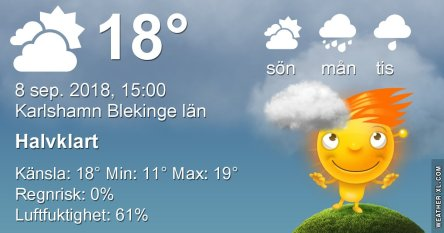
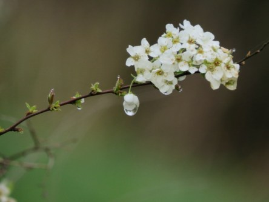
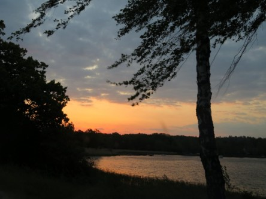

Idag går solen upp 06:18 och ned 19:37. Dagens längd är 13 timmar och 19 minuter. Det är gryning 05:39 och skymning 20:16 Det är dagsljus 14 timmar och 37 minuter. Månen går upp 04:04 och ned 19:22 Månen är belyst 4 %.

 Molnigt 13,9 C  Vindby 0,3 m/s SW  Luftfuktighet 97 %  hPa 1009 Kl.02:30

 Växlande molnighet 8 C  Vindstilla  Luftfuktighet 99 %  hPa 1011 Kl.06:40

 Växlande molnighet 23,6 C  Vindby 3,4 m/s WSW   Luftfuktighet 49 %  hPa 1013 Kl.14:30

 Växlande molnighet 13,5 C  Vindby 0,3 m/s NE  Luftfuktighet 81 %  hPa 1015 Kl.20:05

 Det har varit en ganska blåsig dag och mycket sol, men som vanligt inget regn.

Högst och lägst uppmätta temperatur igår (inofficiellt privat mätare): Max 25 C , Min 14,1 C Högst uppmätta vind 2,4 m/s. Högst uppmätta vindby 4,6 m/s

Högst och lägst uppmätta temperatur igår (officiellt enligt [YR.NO](http://www.vackertvader.se/v%C3%A4derstation/karlshamn?utm_source=email&utm_medium=email&utm_campaign=asarum)) Max 21,9 C, Min 13,3 C Högst uppmätta vind 5 m/s. Högst uppmätta vindby 10,1 m/s

 En salig blandning från arkivet del 3
