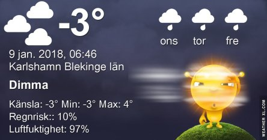
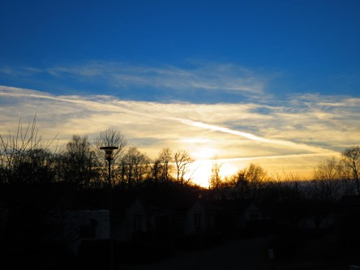

Idag går solen upp 08:29 och ned 15:46. Månen går upp 00:24 och ned 11:53 Månen är belyst 49 %. Dagens längd är 7 timmar och 17 minuter

 Dimma  - 2,5 C  Vind0,7 m/s NE  Luftfuktighet 94 %    hPa 1031 Kl.01:15

 Dimma  - 3,6 C  Vindby 1 m/s NNW  Luftfuktighet 95 %  hPa 1029 Kl.06:15

 Växlande molnighet 1,8 C  Vindby 4,1 m/s E  Luftfuktighet 93 %  hPa 1024 Kl.14:00

 Klart 0,5 C  Vindby 3 m/s E  Luftfuktighet 81 %  hPa 1018 Kl.20:50

 Dagen började grått och dimmigt för att sen bli solig och fin.

Högst och lägst uppmätta temperatur igår (inofficiellt privat mätare): Max 0,9 C , Min – 6,3 C Högst uppmätta vind 0,7 m/s. Högst uppmätta vindby 1,7 m/s.

Högst och lägst uppmätta temperatur igår (officiellt enligt [YR.NO](http://www.vackertvader.se/v%C3%A4derstation/karlshamn?utm_source=email&utm_medium=email&utm_campaign=asarum)) Max 0 C, Min – 4,7 C Högst uppmätta vind 2,2 m/s. Högst uppmätta vindby 4,2 m/s

 Från dimma på morgonen till klarblå himmel och sol.
