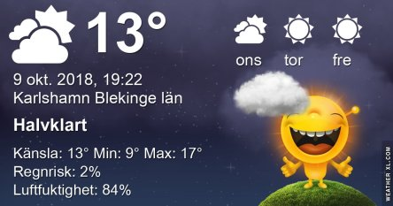
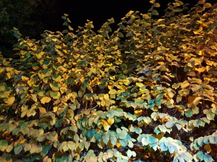
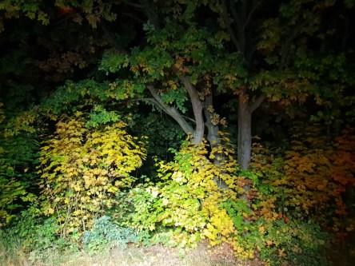
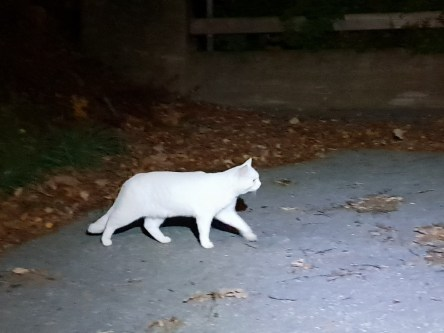
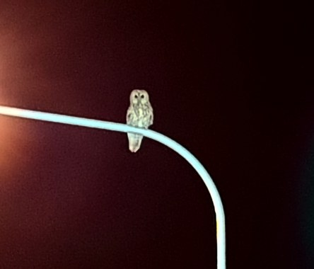

Idag går solen upp 07:19 och ned 18:15. Dagens längd är 10 timmar och 56 minuter. Det är gryning 06:42 och skymning 18:53 Det är dagsljus 12 timmar och 11 minuter. Månen går upp 07:16 och ned 18:49 Månen är belyst 6 %.

 Molnigt 8,3 C   Vindby 0,6 m/s ENE  Luftfuktighet 81 %  hPa 1014 Kl.01:55

 Molnigt 9,2 C  Vindby 2 m/s ENE  Luftfuktighet 84 %  hPa 1013 Kl.06:35

 Mest molnigt 18 C  Vindby 2,4 m/s SSE  Luftfuktighet 72 %  hPa 1015 Kl.13:20

 Molnigt 9,2 C  Vindby 1 m/s SSW  Luftfuktighet 88 %  hPa 1015 Kl.19:50

 Ännu en härlig brittsommardag är till ända.

Högst och lägst uppmätta temperatur igår (inofficiellt privat mätare): Max 15,2 C , Min - 0,3 C Högst uppmätta vind 2,7 m/s, Högst uppmätta vindby 5,1 m/s

Högst och lägst uppmätta temperatur igår (officiellt enligt [YR.NO](http://www.vackertvader.se/v%C3%A4derstation/karlshamn?utm_source=email&utm_medium=email&utm_campaign=asarum)) Max 12,6 C, Min  0,8 C Högst uppmätta vind 3 m/s. Högst uppmätta vindby 9,8 m/s

 Höstens färger i mörkret och några mer än jag som är vaken då.

 Och sist ett konst(igt) tåg!
