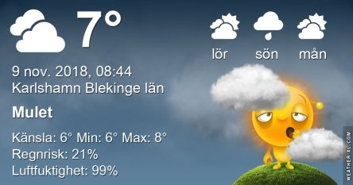

Idag går solen upp 07:25 och ned 16:03 Dagens längd är 8 timmar och 38 minuter. Det är gryning 06:44 och skymning 16:44 Det är dagsljus 10 timmar och 00 minuter. Månen går upp 09:07 och ned 17:22 Månen är belyst 2 %.

 Molnigt 6,8 C  Vindby 0,7 m/s W  Luftfuktighet 94 %  hPa 1016 Kl.02:20

 Dimma 7,2 C  Vindby 0,7 m/s NW  Luftfuktighet 95 %  hPa 1016  Regn 0,5 mm Kl.07:40

 Molnigt 9,1 C  Vindby 1 m/s N  Luftfuktighet 84 %  hPa 1014 Kl.14:45

 Molnigt 7,8 C  Vindby 0,6 m/s E  Luftfuktighet 94 %  hPa 1013 Kl.20:00

 Många nyanser av grått har den här dagen bestått av.

Högst och lägst uppmätta temperatur igår (inofficiellt privat mätare): Max 8,9 C , Min 4,1 C Högst uppmätta vind 0,7 m/s, Högst uppmätta vindby 1,4 m/s

Högst och lägst uppmätta temperatur igår (officiellt enligt [YR.NO](http://www.vackertvader.se/v%C3%A4derstation/karlshamn?utm_source=email&utm_medium=email&utm_campaign=asarum)) Max 7,5 C, Min 4,5 C Högst uppmätta vind 1,6 m/s. Högst uppmätta vindby 3,1 m/s

 En liten resa tillbaks i tiden när vi besökte Disney World i Paris.
