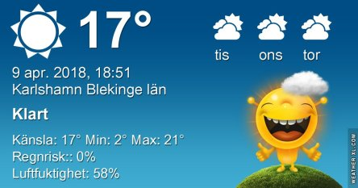
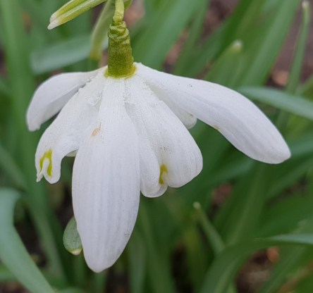
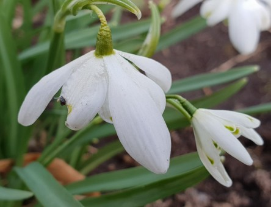
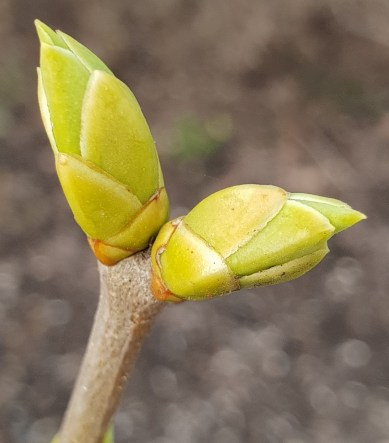

Idag går solen upp 06:11 och ned 19:54. Månen går upp 03:56 och ned 12:01 Månen är belyst 43 %. Dagens längd är 13 timmar och 43 minuter

 Mest klart - 0,8 C  Vindstilla  Luftfuktighet 85 %  hPa 1004 Kl.02:25

 Dimma - 1,8 C  Vindby 0,3 m/s N  Luftfuktighet 91 %  hPa 1003 Kl.06:25

 Tunna slöjmoln och sol 25,5 C  Vindby 3,4 m/s ESE  Luftfuktighet 38 %  hPa 1002  UV 2 Kl.12:45

 Halvklart 11,9 C  Vindstilla  Luftfuktighet 61 %  hPa 1002 Kl.19:55

 Idag har det varit högsommar med sol och riktigt varmt.

Högst och lägst uppmätta temperatur igår (inofficiellt privat mätare): Max 17,5 C , Min – 3,2 C Högst uppmätta vind 2,7 m/s. Högst uppmätta vindby 5,1 m/s.

Högst och lägst uppmätta temperatur igår (officiellt enligt [YR.NO](http://www.vackertvader.se/v%C3%A4derstation/karlshamn?utm_source=email&utm_medium=email&utm_campaign=asarum)) Max 12,8 C, Min – 2,7 C Högst uppmätta vind 3,4 m/s. Högst uppmätta vindby 8,1 m/s

 Nu börjar det blomma och knoppas i trädgården.
