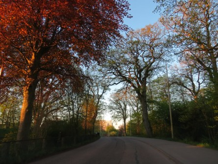

Idag går solen upp 04:59 och ned 20:55. Månen går upp 03:24 och ned 13:03 Månen är belyst 40 %. Dagens längd är 15 timmar och 56 minuter

 Kart 5,2 C  Vindby 0,4 m/s ESE  Luftfuktighet 93 %  hPa 1012 Kl.02:05

 Halvklart 14,8 C  Vindby 1,4 m/s NE  Luftfuktighet 61 %  hPa 1011 Kl.07:25

 Halvklart 26,6 C  Vindby 5,2 m/s NE  Luftfuktighet 37 %  hPa 1011 Kl.15:05

 Halvklart 16 C  Vindby 0,8 m/s E  Luftfuktighet 54 %  hPa 1009 KL.20:00

 Sommarvärmen fortsätter med över 30 grader i solen.

Högst och lägst uppmätta temperatur igår (inofficiellt privat mätare): Max 31 C ( i solen ) , Min 3,5 C Högst uppmätta vind 1,4 m/s. Högst uppmätta vindby 2,7 m/s.

Högst och lägst uppmätta temperatur igår (officiellt enligt [YR.NO](http://www.vackertvader.se/v%C3%A4derstation/karlshamn?utm_source=email&utm_medium=email&utm_campaign=asarum)) Max 22 C, Min 3,2 C Högst uppmätta vind 3,6 m/s. Högst uppmätta vindby 6,6 m/s

 Solen lyste på träden på morgonen så att det nästan såg höstlikt ut i färgerna.

 På väg upp för att värma upp ytterligare en dag.
