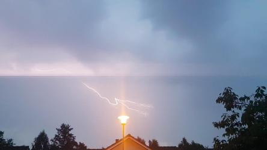
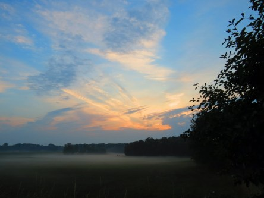
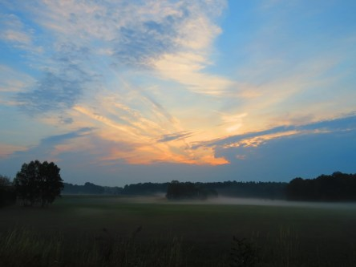

Idag går solen upp 05:19 och ned 20:52. Dagens längd är 15 timmar och 33 minuter. Det är gryning 04:33 och skymning 21:38 Det är dagsljus 17 timmar och 05 minuter. Månen går upp 02:41 och ned 19:31 Månen är belyst 8 %.

 Regn 19,9 C  Vindby 0,3 m/s W  Luftfuktighet 96 %  hPa 1008  Regn 1,2 mm Kl.01:50

 Tunna moln och en del dimma 19,3 C  Vindstilla  Luftfuktighet 96 %  hPa 1011 Kl.06:50

 Tunna moln 33,3 C  Vindby 2,4 m/s WNW  Luftfuktighet 42 %  hPa 1012 Kl.13:00

 Halvklart 23,5 C  Vindby 1 m/s S  Luftfuktighet 61 %  hPa 1009 Kl.19:40

 När det äntligen kom lite regn så var det med betoning på lite, 4 mm bara.

Högst och lägst uppmätta temperatur igår (inofficiellt privat mätare): Max 31,2 C ( i solen ), Min 14 C Högst uppmätta vind 3,1 m/s. Högst uppmätta vindby 5,8 m/s

Högst och lägst uppmätta temperatur igår (officiellt enligt [YR.NO](http://www.vackertvader.se/v%C3%A4derstation/karlshamn?utm_source=email&utm_medium=email&utm_campaign=asarum)) Max 26,9 C, Min 11,7 C Högst uppmätta vind 4,8 m/s. Högst uppmätta vindby 9,3 m/s

 Det blev ett ordentligt åskväder igår kväll, men bara lite regn.

 Och efter nattens åskväder var solen redo att plåga oss igen med en riktigt het dag.
