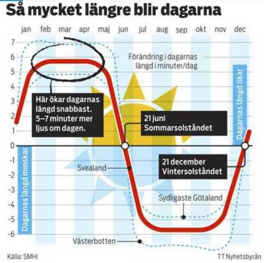
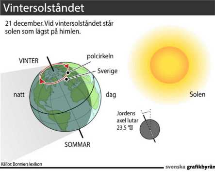

### **Fredag den 21 December inträffar vintersolståndet 2018**

 Jippi! Nu blir det ljusare igen!

 Så här mycket ljusare blir det nu.

_Snart släpper mörkret greppet om oss. För den 21 december vänder det och det blir ljusare, även om det inte blir varmare._

_21 december 2018 är årets kortaste dag. Hur länge solen visar sig beror på var du bor och om det är molnfritt._ 

_Nära Sveriges mittpunkt Östersund går solen upp 9.41 och försvinner igen redan 14.17. Längst i söder går den upp 8.31 och ner 15.33. Och i norr i Kiruna går solen ner den 10 december och tittar fram först 1 januari. Anledningen är att Kiruna ligger norr om polcirkeln._ 

## Vintersolståndet är egentligen inte en dag

_Själva vintersolståndet inträffar klockan 23.23. Det är då det är som mörkast och dagen är som kortast. Tidpunkten för vintersolståndet flyttar sig cirka sex timmar framåt per år, vid skottår flyttas tidpunkten tillbaka cirka 18 timmar._

_Efter vintersolståndet blir dagen längre och ljusare. Först händer nästan ingenting. Först i januari tar det fart och vi märker skillnaderna. På en vecka kan det solen gå upp 15 minuter tidigare på förmiddagen och gå ner en kvart senare på eftermiddagen._

_Det är först när vi kommer till vårdagjämningen i mars som natt och dag blir lika långa._

## Varför blir det inte varmare när dagarna blir längre?

_Det blir ljusare, men inte varmare. Anledningen är att solens stålar inte räcker för att värma upp våra breddgrader. Medeltemperaturen i Sverige i december är –6 grader, det blir 2 grader kallare, –8 grader i januari och åter -6 grader kallt i februari. Först i mars blir det plus minus noll._

## Då inträffar vintersolståndet

_2018: 21 december, kl 23.23._

_2019: 22 december, kl 05.19._

_2020 (skottår): 21 december, kl 11.02._

_2021: 21 december, kl 16.59._

_2022: 21 december, kl 22.48._

_2023: 22 december, kl 04.27._

_2024 (skottår): 21 december, kl 10.20._

_2025: 21 december, kl 16.03._

## Därför är det inte samma datum varje år

_Eftersom det tar jorden ungefär 365 dagar och sex timmar att färdas runt solen så förskjuts vintersolståndet med cirka sex timmar från år till år. En tumregel är att året före skottår äger vintersolståndet rum i Sverige den 22 december._

## Hur länge har vi känt till vintersolståndet?

_Vi har känt till vintersolståndet i minst 5 000 år. Det visar stenåldersgraven Newgrange i Irland, ett byggnadsverk som utfördes under neolitisk tid. Det fina med Newgrange är att det är byggt så att solens strålar bara når bortersta väggen i en lång gång under årets kortaste dag. Hur det uppkom och vem som byggde det är okänt._ 

_Men hade det inte varit för arkeologen och professorn Michael J O’Kelly [skulle kunskapen ha varit förlorad](https://www.expressen.se/nyheter/inloggad/mysteriet-bakom-vintersolstandet/) för alltid._ 

## Det betyder vintersolståndet exakt – så här går det till

_Jorden snurrar runt solen i en elliptisk bana runt solen på lite drygt 365 dagar. Jorden roterar i sin tur runt sin axel med ett varv per dygn. Eftersom jorden "lutar" kommer det att upplevas att solen rör sig mellan vändkretsarna i syd och norr. Detta skapar årstider och vintersolstånd, sommarsolstånd och vår- och höstdagjämningen beroende på var jorden befinner sig på resan runt solen._

_Den 21 december är den dag då solen står som längst söderut, vid Stenbockens vändkrets. För oss är det årets kortaste dag. Bor man i Australien eller på en annan plats söder om ekvatorn är det årets längsta dag._

_Text Lennart Nilsson Expressen_
