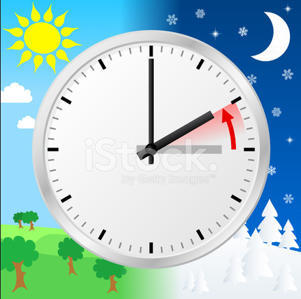

**Vintertid 2018**

_Inatt den 28/10 är det dags att vrida tillbaka klockan en timme igen. Klockan 03:00 blir 02:00 istället. Förhoppningsvis så är det sista eller näst sista gången vi behöver göra detta. Det är ingenting jag kommer att sakna eftersom jag aldrig tyckt om det här helt onödiga påfundet. Så håll tummarna för att vi slipper det i fortsättningen._

