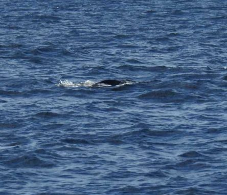
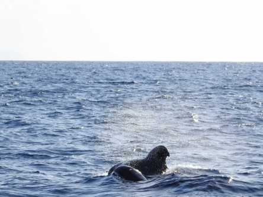
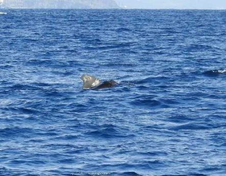
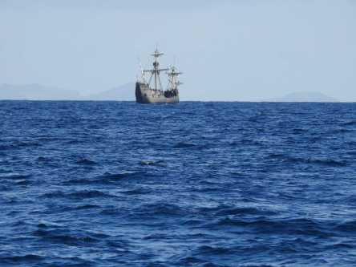
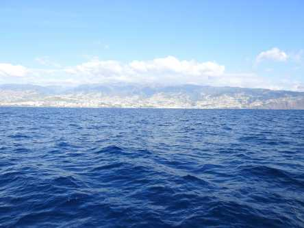
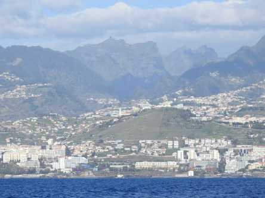
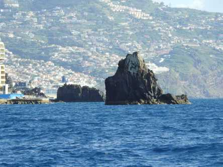
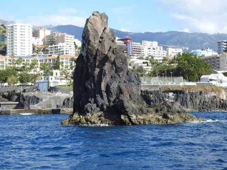

## **Delfiner och pilotvalar på Madeira**

_Här kommer lite bilder från var delfin och valsafari som vi gjorde sista dagen på Madeira. Vi hade turen att få se både delfiner och valar. Dessutom såg jag en sköldpadda som simmade in under båten, men den fick jag tyvärr inga bilder på. Det var inte helt lätt att fånga valarna på bild eftersom det var ganska mycket vågor och man visste aldrig var de skulle dyka upp. Så min strategi blev att helt enkelt inte ha för mycket zoom och sedan bara trycka av hela tiden och hoppas att någon fastnade på bild. Och faktiskt så lyckades det över förväntan. Här ser ni resultatet av mina försök till valfotograf._

 _Först några bilder på havet när vi åkte ut med båten._

 _Första valbilden._

 _Här syns två stycken samtidigt._

 _Jag tror att det är två här med._

 _Tyvärr blev den här suddig på två som simmade sida vid sida._

 _Här lyckades jag få med två delfiner._

 _En delfin till._

 _Ytterligare två delfiner._

 _Ett ståtligt skepp som vi åkte förbi på tillbakavägen._

 _Lite bilder från vår väg tillbaka efter en otrolig upplevelse bland vilda valar och delfiner._
