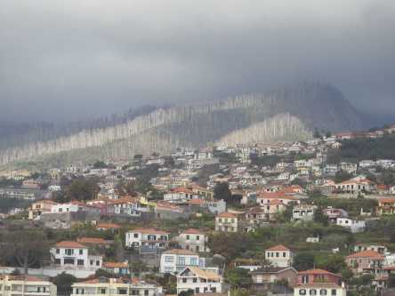
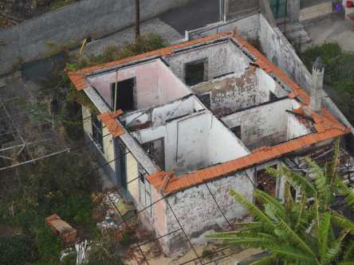
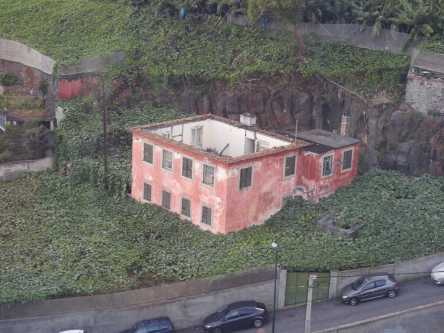

## **Branden i Monte på Madeira 2010**

_År 2010 roade sig en 25 årig full kille med att sätta fyr på vägen upp mot Monte på Madeira. Det är här den längsta linbanan går upp till Tropical Garden och Botanic garden. Fyra människor dog i branden, äldre människor som brändes inne i sina hem. Över 1000 människor fick evakueras och minst 250 hus förstördes, plus en stor del av naturen blev helt nerbränt. Fåglarna i Parrot Garden i botaniska trädgården blev svårt rökskadade och vårdas än i dag med mediciner och anläggningen är fortfarande stängd för att skydda fåglarna som inte mår bra. Vi åkte med linbanan upp till Monte och jag tog dessa bilder från linbanan._

 _Här ser man brandskadad skog på vägen upp till Monte_

 _Här ser man hus som är svårt brandskadade och som inte har byggts upp igen. Alla hade inte försäkringar som täckte skadorna och hade därför inte råd att bygga upp sina hus igen utan blev hemlösa. En så sorglig historia, speciellt med tanke på att branden var anlagd med vett och vilja. Killen som satte eld åkte som väl var fast och fick 30 år i fängelse. På Madeira är 25 år maxstraffet, men han fick 5 år extra på grund av att människor dog i branden._

_I kommande inlägg visar jag trevligare bilder från utsikten från linbanan._
