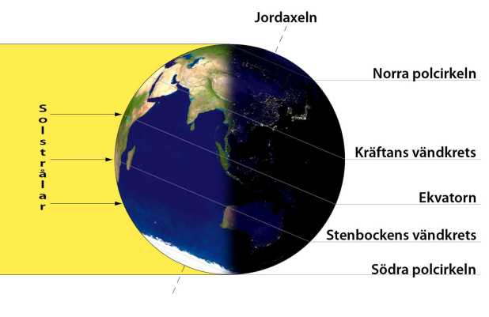

## _**Äntligen går vi mot ljusare tider igen!**_

Vintersolståndet 2019 inträffar den 22 december, mer exakt klockan 04.19 på morgonen.

Då står solen som lägst på himlen sett från norra halvklotet. Överallt norr om polcirkeln råder polarnatt, solen går inte upp alls.

## _**Årets kortaste dag 2019**_

Varför blir det då så här?

Jo, Jordens rotationsaxel lutar i förhållande till solen, vilket skapar årstiderna. När den axeln lutar som mest bort från solen står solen som lägst på himlen, och dagen blir alltså som kortast.

## **_Vintersolståndet – firar vi det?_**

Många gillar att uppmärksamma att vi går mot ljusare tider, men i förkristna tider hade vintersolståndet en stor kulturell betydelse. I det romerska riket firade man vinterhögtiden Saturnalia i anslutning till vintersolståndet, och här i norden hade vi offerriten Midvinterblot, som senare kom att kallas jólablot. En föregångare till ”juldrickandet”, det hedniska julfirandet som sedermera slogs ihop med det kristna högtidsfirandet.

## **_Årets ljusaste dag 2020_**

Vad har vi att se fram emot? Jo, sommarsolståndet kommer inträffa den 20:e juni. Fram till dess blir det bara ljusare och ljusare.

Adam Wållgren[adam.wallgren@expressen.se](mailto:adam.wallgren@expressen.se)

[Här](https://sv.wikipedia.org/wiki/Vintersolst%C3%A5ndet) kan du läsa mer om vintersolståndet.
