### **Sista stoppen innan vi är tillbaks i Edinburgh**

_På vägen ner till Edinburgh stannar vi till vid The Highland Folk Museum, ett utomhusmuseum som ligger i Newtonmore. Här är några bilder på de små husen och området de ligger i bland höga träd och härlig natur._

_Lite grisigt var det allt här hahaha._

  _Slappande i det gröna._

[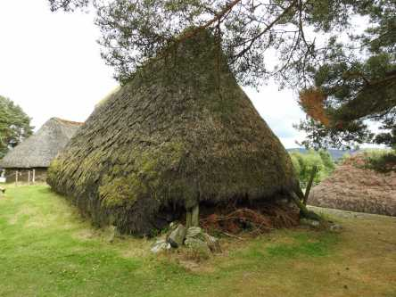](https://worldwideweatherblog.wordpress.com/wp-content/uploads/2019/01/dscn0158-1600x1200.jpg)

 _I dessa små hyddor bodde det en gång i tiden människor. Här hade de sin vardag med bruk av jorden och djur att sköta._

 _Så här kunde det se ut i stugorna._

[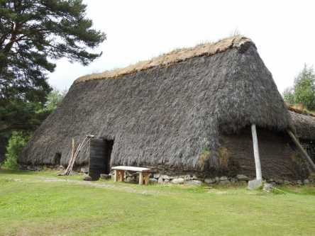](https://worldwideweatherblog.wordpress.com/wp-content/uploads/2019/01/dscn0172-1600x1200.jpg)

[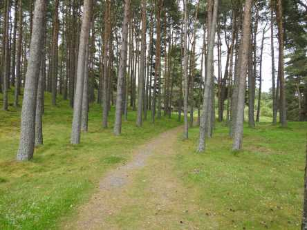](https://worldwideweatherblog.wordpress.com/wp-content/uploads/2019/01/dscn0176-1600x1200.jpg)

[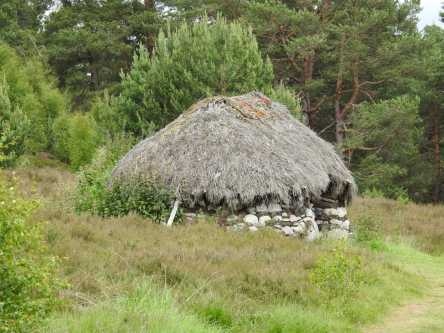](https://worldwideweatherblog.wordpress.com/wp-content/uploads/2019/01/dscn0177-1600x1200.jpg)

[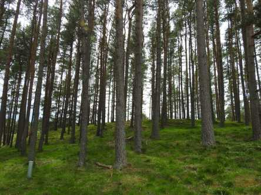](https://worldwideweatherblog.wordpress.com/wp-content/uploads/2019/01/dscn0179-1600x1200.jpg)

[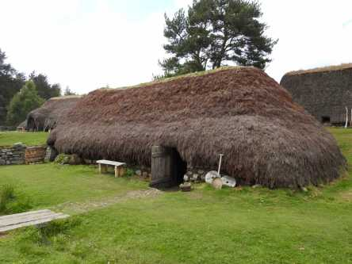](https://worldwideweatherblog.wordpress.com/wp-content/uploads/2019/01/dscn0186-1600x1200.jpg) _Stugorna ligger utspridda i skogen. Så avkopplande och lugnt att vandra omkring här. Men att bo och leva här var nog inte alltid så avkopplande._

_Nu är vi redo för vår färd ner mot Edinburgh med ett snabbt stopp i Inverness på vägen_

[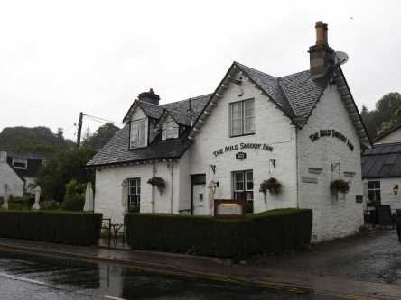](https://worldwideweatherblog.wordpress.com/wp-content/uploads/2019/01/dscn0199-1600x1200.jpg)

[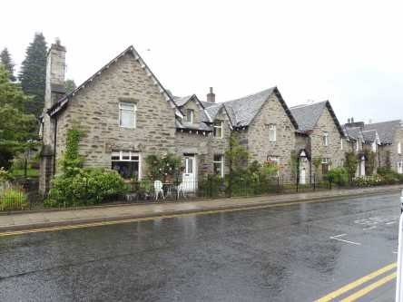](https://worldwideweatherblog.wordpress.com/wp-content/uploads/2019/01/dscn0201-1600x1200.jpg)

[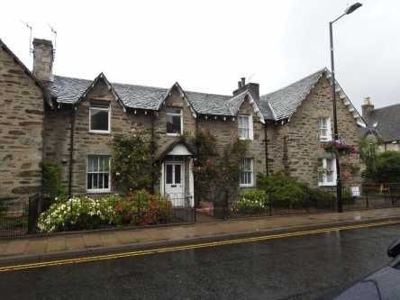](https://worldwideweatherblog.wordpress.com/wp-content/uploads/2019/01/dscn0203-1600x1200.jpg)

[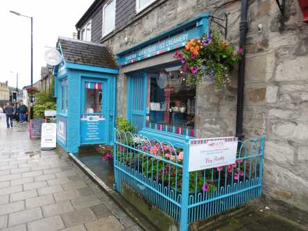](https://worldwideweatherblog.wordpress.com/wp-content/uploads/2019/01/dscn0209-1600x1200.jpg)

 _Tillbaks i regnigt Inverness för lite mat och bensträck innan vi kör vidare mot Edinburgh._

 _Här åt vi Fish and Chips på vår första resa i Skottland, så vi bestämde oss för att äta här igen._

[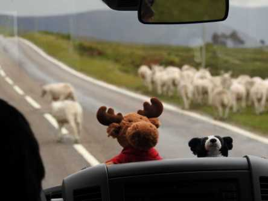](https://worldwideweatherblog.wordpress.com/wp-content/uploads/2019/01/dscn9980-1600x1200.jpg) _Nu åker vi och våra små maskot(t)ar ner till Edinburgh igen. I nästa inlägg avslutar vi vår resa med ett par dagar i Edinburgh innan vi flyger hem till Sverige igen._
