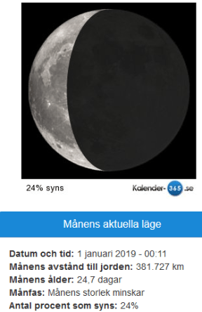
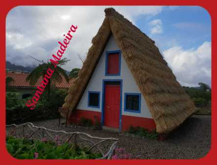

Idag går solen upp 08:33 och ned 15:35 Dagens längd är 7 timmar och 2 minuter. Det är gryning 07:46 och skymning 16:22 Det är dagsljus 8 timmar och 36 minut. Månen går upp 03:25 och ned 13:06 Månen är belyst 24 %.

Molnigt 6,9 C  Vindby 5,6 m/s SW  Luftfuktighet 83 %  hPa 1007 Kl.01:25

 Molnigt 7,2 C  Vindby 3,4 m/s E  Luftfuktighet 68 %  hPa 998  Regn 0,5 mm Kl.07:05

Växlande molnighet 7,3 C  Vindby 3,8 m/s ESE  Luftfuktighet 59 %  hPa 994 Kl.14:20

Mest klart 3 C  Vindby 3,1 m/s SE  Luftfuktighet 65 %  hPa 996 Kl.19:55

 Efter en vecka på Madeira med sol och värme är man tillbaks i vardagslunken igen. Ändå ganska skönt.

Högst och lägst uppmätta temperatur igår (inofficiellt privat mätare) Max 7,4 C , Min – 0,3 C Högst uppmätta vind 3,1 m/s, Högst uppmätta vindby 5,1 m/s

Högst och lägst uppmätta temperatur igår (officiellt enligt [YR.NO](http://www.vackertvader.se/v%C3%A4derstation/karlshamn?utm_source=email&utm_medium=email&utm_campaign=asarum)) Max 6,8 C, Min - 1,3 C Högst uppmätta vind 2.8 m/s. Högst uppmätta vindby 6.7 m/s

 Nyss hemkommen så har jag inte hunnit få ordning på alla bilder jag tog så det får bli ett litet smakprov på deras berömda A hus som ligger i Santana uppe i bergen på Madeira. Mer bilder kommer i framtida inlägg.
