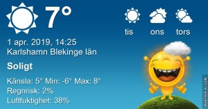

Idag går solen upp 06:32 och ned 19:38 Dagens längd är 13 timmar och 06 minuter. Det är gryning 05:54 och skymning 20:17 Det är dagsljus 14 timmar och 23 minuter. Månen går upp 06:02 och ned 14:56 Månen är belyst 17 %

 Mest klart - 3,4 C  Vindby 0,6 m/s W  Luftfuktighet 55 %  hPa 1022 Kl.01:20

 Klart - 7,3 C  Vindstilla  Luftfuktighet 67 %  hPa 1024 Kl.06:10

 Klart 14 C Vindby 3 m/s NE  Luftfuktighet 22 %  hPa 1026 Kl.14:15

 Klart 0 C  Vindby 0,3 m/s NW  Luftfuktighet 68 %  hPa 1023 Kl.20:10

 Soligt och fint men iskallt idag!

Högst och lägst uppmätta temperatur igår (inofficiellt privat mätare) Max 17 (i solen) , Min - 1,6 C Högst uppmätta vind 4,1 m/s, Högst uppmätta vindby 6,5 m/s

Högst och lägst uppmätta temperatur igår (officiellt enligt [YR.NO](http://www.vackertvader.se/v%C3%A4derstation/karlshamn?utm_source=email&utm_medium=email&utm_campaign=asarum)) Max 10 C, Min - 3,9 C Högst uppmätta vind 5,8 m/s. Högst uppmätta vindby 12,7 m/s

\[gallery type="rectangular" link="file" size="large" ids="28084,28085,28087,28088,28089,28090,28091,28092,28093,28094,28095,28096" orderby="rand"\]

Några dagsfärska bilder från min tur till havet i det kalla vårvädret!

 Ibland blir fel rätt!
