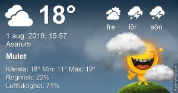

Idag går solen upp 05:03 och ned 21:10 Dagens längd är 16 timmar och 07 minuter. Det är gryning 04:14 och skymning 21:58 Det är dagsljus 17 timmar och 44 minuter. Månen går upp 05:07 och ned 21:33 Månen är belyst 0 %

'

 Molnigt 11,5 C  Vindby 0,3 m/s SE  Luftfuktighet 84 %  hPa 1014 Kl.02:25

 Mest molnigt 13,1 C  Vindby 1,2 m/s W  Luftfuktighet 85 %  hPa 1014 Kl.06:55

 Molnigt 24,7 C  Vindby 2 m/s SW  Luftfuktighet 54 %  hPa 1013 Kl.14:50

 Molnigt 15,5 C  Vindby 0,8 m/s NNE  Luftfuktighet 79 %  hPa 1013 Kl.20:05

 

 Normal sommar med mindre varmt och mest moln. Men inget regn!

 

Högst och lägst uppmätta temperatur igår (inofficiellt privat mätare) Max 29 ( i solen )  , Min 12,8 C Högst uppmätta vind 2,4 m/s, Högst uppmätta vindby 4,4 m/s

Högst och lägst uppmätta temperatur igår (officiellt enligt [YR.NO](http://www.vackertvader.se/v%C3%A4derstation/karlshamn?utm_source=email&utm_medium=email&utm_campaign=asarum)) Max 19,8 C, Min 12,5 C Högst uppmätta vind 3,6 m/s. Högst uppmätta vindby 7,2 m/s

 

## _**Lite allvar behövs ibland**_

Som det här vädjandet från polisen som jag läste i en artikel i [Allt om Bilar](https://www.expressen.se/motor/trafik/polisen-ryter-nu-ifran-fullkomligt-obegripligt/?utm_campaign=aob-newsletter-2019v31&utm_source=expressen-aob-email&utm_medium=email&utm_content=link&utm_term=)

 Allt för många tänker sig inte för när de varnar andra säkert i all välmening. Men den omtanken bör istället gälla dem som utsätts för dem som kör olagligt på ett eller annat sätt. Har du inte gjort något fel så har du inget att vara orolig för om det dyker upp en poliskontroll.
