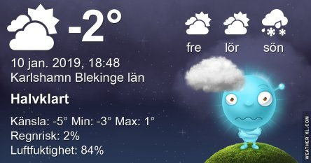

Idag går solen upp 08:28 och ned 15:48 Dagens längd är 7 timmar och 20 minuter. Det är gryning 07:42 och skymning 16:34 Det är dagsljus 8 timmar och 52 minuter. Månen går upp 10:40 och ned 20:28 Månen är belyst 14 %.

 Växlande molnighet - 3,3 C  Vindby 2,4 m/s WNW  Luftfuktighet 70 %  hPa 1017 Kl.01:40

 Molnigt - 2,7 C  Vindby 2 m/s N  Luftfuktighet 72 %  hPa 1018 Kl.07:00

 Mest molnigt 0,5 C  Vindby 0,4 m/s W  Luftfuktighet 61 %  hPa 1018 Kl.14:45

Mest molnigt - 3,5 C  Vindby 0,7 m/s S  Luftfuktighet 75 %  hPa 1016 Kl.19:50

Kallt men lite sol åtminstone

Högst och lägst uppmätta temperatur igår (inofficiellt privat mätare) Max 3 C , Min - 2,8 C Högst uppmätta vind 4,8 m/s, Högst uppmätta vindby 9,9 m/s

Högst och lägst uppmätta temperatur igår (officiellt enligt [YR.NO](http://www.vackertvader.se/v%C3%A4derstation/karlshamn?utm_source=email&utm_medium=email&utm_campaign=asarum)) Max 1,5 C, Min - 2,1 C Högst uppmätta vind 5,9 m/s. Högst uppmätta vindby 13,8 m/s

\[gallery type="rectangular" link="file" size="large" ids="26416,26417,26418,26419,26420,26421,26422,26423" orderby="rand"\]

Lite blandade bilder från Funchal både kvällstid och dagtid, i regn och utan regn.
