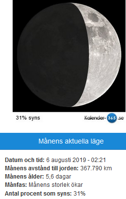

Idag går solen upp 04:27 och ned 21:44 Dagens längd är 17 timmar och 17 minuter. Det är gryning 03:28 och skymning 22:43 Det är dagsljus 19 timmar och 15 minuter. Månen går upp 14:39 och ned 00:52 Månen är belyst 55 %

 Mest molnigt 8,3 C  Vindstilla  Luftfuktighet 99 %  hPa 1009 Kl.01:35

 Mest molnigt 10 C  Vindstilla  Luftfuktighet 97 %  hPa 1008 Kl.07:00

 Regn 20,9 C  Vindby 0,8 m/s N  Luftfuktighet 75 %  hPa 1007  Regn 2,2 mm Kl.13:25

 Växlande molnighet 14,5 C  Vindby 1 m/s W  Luftfuktighet 67 %  hPa 1009  Regn 3,7 mm Kl.19:50

 Ännu lite mer regn idag!

 

Högst och lägst uppmätta temperatur igår (inofficiellt privat mätare) Max 25,9 ( i solen )  , Min 8,3 C Högst uppmätta vind 2,4 m/s, Högst uppmätta vindby 4,1 m/s

Högst och lägst uppmätta temperatur igår (officiellt enligt [YR.NO](http://www.vackertvader.se/v%C3%A4derstation/karlshamn?utm_source=email&utm_medium=email&utm_campaign=asarum)) Max 21,3 C, Min 10,4 C Högst uppmätta vind 3,9 m/s. Högst uppmätta vindby 9,3 m/s

 

## _**Blandade bilder från Liverpool**_

 

\[gallery type="rectangular" link="file" size="large" ids="30398,30399,30400,30401,30402,30403,30404,30405,30406,30407,30408,30409,30410,30411,30412,30413"\]

Lite olika bilder nere från hamnen i Liverpool. Det blåste så kraftigt så att man knappt kunde gå där bitvis men vi tog oss runt ändå. Skam den som ger sig!
