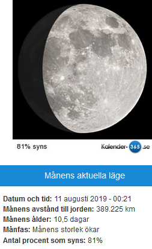
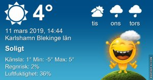

Idag går solen upp 06:28 och ned 17:55 Dagens längd är 11 timmar och 27 minuter. Det är gryning 05:50 och skymning 18:32 Det är dagsljus 12 timmar och 42 minuter. Månen går upp 08:30 och ned 23:12 Månen är belyst 17 %

 Klart - 7,2 C  Vindby 0,7 m/s N  Luftfuktighet 74 %  hpa 997 Kl.02:20

 Växlande molnighet och kallt - 8,3 C  Vindby 0,3 m/s NW  Luftfuktighet 77 %  hPa 999 Kl.06:50

 Växlande molnighet 10,6 C  Vindby 3,6 m/s WNW  Luftfuktighet 26 %  hPa 1001 Kl.13:30

 Växlande molnighet - 4 C  Vindstilla  Luftfuktighet 52 %  hPa 1006 Kl.19:50

 En fin dag med sol och blå himmel!

Högst och lägst uppmätta temperatur igår (inofficiellt privat mätare) Max 10,5 , Min - 5,9 C Högst uppmätta vind 3,4 m/s, Högst uppmätta vindby 6,1 m/s

Högst och lägst uppmätta temperatur igår (officiellt enligt [YR.NO](http://www.vackertvader.se/v%C3%A4derstation/karlshamn?utm_source=email&utm_medium=email&utm_campaign=asarum)) Max 6,8 C, Min - 3,8 C Högst uppmätta vind 4,3 m/s. Högst uppmätta vindby 12,3 m/s

\[gallery type="rectangular" link="file" size="large" ids="27767,27768,27769,27770,27771,27772,27773,27774,27775"\]

I väntan på att inspirationen till att gå ut och ta lite nya bilder infinner sig så får det bli arkivbilder. Här några som är tagna uppifrån Burj Khalifa i Dubai.
