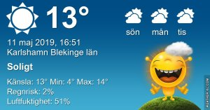

Idag går solen upp 04:55 och ned 21:00 Dagens längd är 16 timmar och 05 minuter. Det är gryning 04:07 och skymning 21:49 Det är dagsljus 17 timmar och 42 minuter. Månen går upp 10:42 och ned 02:23 Månen är belyst 38 %

 Dimma 6,3 C  Vindby 0,7 m/s SE  Luftfuktighet 97 %  hPa 1005 Kl.02:05

 Mest klart 13,1 C  Vindby 1,6 m/s ENE  Luftfuktighet 61 %  hPa 1008 Kl.09:00

 Mest klart 16 C  Vindby 1,7 m/s S  Luftfuktighet 38 %  hPa 1008 Kl.13:50

 Mest klart 10,5 C  Vindby 1.8 m/s W  Luftfuktighet 51 %  hPa 1010 Kl.20:20

 Äntligen lite vårkänsla. Idag fick mina sköldpaddor komma ut i sin hage för första gången den här våren.

Högst och lägst uppmätta temperatur igår (inofficiellt privat mätare) Max 15,1 , Min 6,3 C Högst uppmätta vind 2,7 m/s, Högst uppmätta vindby 5,8 m/s

Högst och lägst uppmätta temperatur igår (officiellt enligt [YR.NO](http://www.vackertvader.se/v%C3%A4derstation/karlshamn?utm_source=email&utm_medium=email&utm_campaign=asarum)) Max 12,9 C, Min 6,4 C Högst uppmätta vind 3 m/s. Högst uppmätta vindby 6,1 m/s

\[gallery type="rectangular" link="file" size="large" ids="28579,28580,28581,28582,28583,28584,28585,28586,28587,28588,28589,28590,28591,28592,28593,28594,28595"\]

Sista dagen i Los Angeles tog vi en tur med en Hop on hop off buss och åkte runt i stan. Vi började med ett stopp i Beverly Hills igen.
