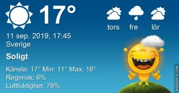

## Onsdag 11 September

I dag gryr dagen i Asarum 05:45. Solen går upp klockan 06:23 och ner klockan 19:30 . Det mörknar vid 20:08. Dagens längd är 13 timmar och 07 minuter. Det är dagsljus 14 timmar och 23 minuter. Månen går upp 19:14 och ned 02:42 Månen är belyst 91 %

I Asarum blir dagen 4 minuter och 36 sekunder kortare. Dagen har blivit 4 timmar och 33 minuter kortare sedan sommarsolståndet. Vintersolstånd om 102 dagar.

Missa inte gyllene timmen som börjar klockan 18:43 i Asarum. Då står solen lågt och kastar ett fint gyllene ljus

 

 Molnigt 12,2 C  Vindstilla  Luftfuktighet 99 %  hPa 1006 Kl.02:00

 Molnigt 14,1 C  Vindby 2,8 m/s ESE  Luftfuktighet 95 %  hPa 1009 Kl.07:05

 Molnigt 22,8 C  Vindby 4,8 m/s NE  Luftfuktighet 53 %  hPa 1013 Kl.14:20

 Molnigt 14,7 C  Vindby 2,4 m/s SW  Luftfuktighet 75 %  hPa 1012 Kl.20:15

Äntligen så pass svalt att man orkar göra något av allt som behöver göras i trädgården

Högst och lägst uppmätta temperatur igår (inofficiellt privat mätare) Max 22,3 , Min 12,3 C Högst uppmätta vind 2 m/s, Högst uppmätta vindby 4,1 m/s

Högst och lägst uppmätta temperatur igår (officiellt enligt [YR.NO](http://www.vackertvader.se/v%C3%A4derstation/karlshamn?utm_source=email&utm_medium=email&utm_campaign=asarum)) Max 20,9 C, Min 11,8 C Högst uppmätta vind 5,2 m/s. Högst uppmätta vindby 10,8 m/s

 

## _**18 år sedan 9/11**_

Idag är det 18 år sedan tvillingtornen i New York blev attackerade av två flygplan som styrdes av terrorister. Här några bilder från Ground Zero när vi var där senast.

\[gallery type="rectangular" link="file" size="large" ids="31720,31721,31722,31723,31724,31725,31726,31727"\]
