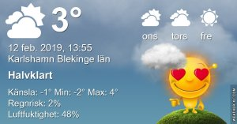
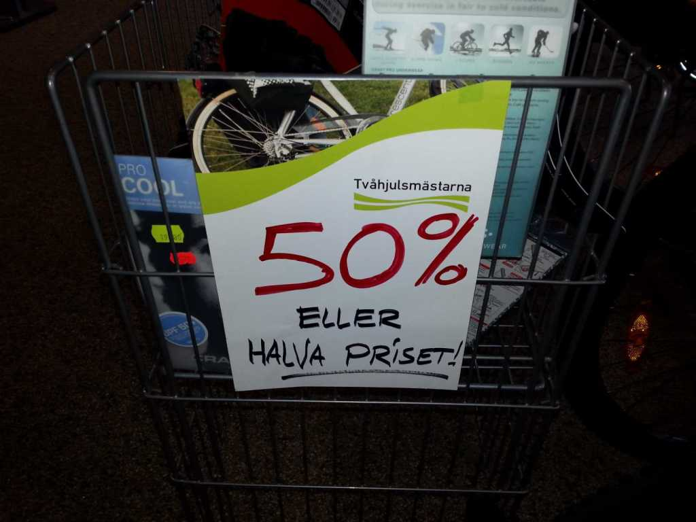
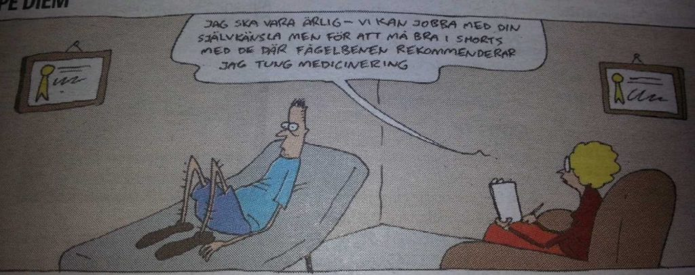

Idag går solen upp 07:34 och ned 16:56 Dagens längd är 9 timmar och 22 minuter. Det är gryning 06:55 och skymning 17:36 Det är dagsljus 10 timmar och 41 minuter. Månen går upp 10:24 och ned 00:08 Månen är belyst 41 %.

 Mest klart - 2,4 C  Vindby 2,6 m/s W  Luftfuktighet 60 %  hPa 1009 Kl.01:15

 Mest klart  - 3,3 C  Vindby 2,4 m/s W  Luftfuktighet 62 %  hPa 1013 Kl.06:15

 Växlande molnighet 5,2 C  Vindby 3,4 m/s NNE  Luftfuktighet 37 %  hPa 1019 Kl.13:55

 Mest molnigt - 0,2 C  Vindby 2,6 m/s WSW  Luftfuktighet 55 %  hPa 1020 Kl.19:45

Nu är frysnätterna slut för ett tag och värmen är på väg.

Högst och lägst uppmätta temperatur igår (inofficiellt privat mätare) Max 7,4 C , Min - 2,1 C Högst uppmätta vind 3,4 m/s, Högst uppmätta vindby 6,5 m/s

Högst och lägst uppmätta temperatur igår (officiellt enligt [YR.NO](http://www.vackertvader.se/v%C3%A4derstation/karlshamn?utm_source=email&utm_medium=email&utm_campaign=asarum)) Max 5,1 C, Min - 0,1 C Högst uppmätta vind 4 m/s. Högst uppmätta vindby 10,2 m/s

 

 Ja, vilket väljer man här? 50 % eller halva priset?

  Apple vs Android. Av detta tror jag alla förstår vad jag föredrar.

Det här känns som jag och min dator, hahaha.

 Stackars man, hoppas det lyckas i alla fall.
