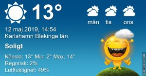

Idag går solen upp 04:53 och ned 21:02 Dagens längd är 16 timmar och 09 minuter. Det är gryning 04:05 och skymning 21:51 Det är dagsljus 17 timmar och 46 minuter. Månen går upp 12:04 och ned 02:09 Månen är belyst 49 %

 Klart 3,4 C  Vindby 0,3 m/s S  Luftfuktighet 81 %  hPa 1013 Kl.01:25

 Växlande molnighet 12,4 C  Vindby 1,4 m/s E  Luftfuktighet 69 %  hPa 1017 Kl.07:30

 Växlande molnighet 21,3 C  Vindby 3,4 m/s S  Luftfuktighet 29 %  hPa 1020 Kl.14:00

 Mest klart 10,5 C  Vindby 1,4 m/s S  Luftfuktighet 32 %  hPa 1023 Kl.19:45

 Ännu en härlig solig dag ed skön värme!

Högst och lägst uppmätta temperatur igår (inofficiellt privat mätare) Max 20,3 , Min 4,7 C Högst uppmätta vind 2,7 m/s, Högst uppmätta vindby 4,4 m/s

Högst och lägst uppmätta temperatur igår (officiellt enligt [YR.NO](http://www.vackertvader.se/v%C3%A4derstation/karlshamn?utm_source=email&utm_medium=email&utm_campaign=asarum)) Max 16,1 C, Min 3,2 C Högst uppmätta vind 3,5 m/s. Högst uppmätta vindby 9 m/s

\[gallery type="rectangular" link="file" size="large" ids="28609,28610,28611"\]

När vi kom till Santa Monica hittade Johannes sin drömbil på gatan! En exakt kopia av bilen från Tillbaka till framtiden filmerna.

\[gallery type="rectangular" link="file" size="large" ids="28612,28613,28615,28616,28617,28646,28645,28644,28643,28647"\]

Lite bilder från Santa Monica Beach.

\[gallery type="rectangular" link="file" size="large" ids="28649,28642,28641,28640,28639,28637,28636,28619"\]

Några bilder från Piren i Santa Monica.

https://www.youtube.com/watch?v=B5Oo\_UKndN4

\[gallery type="rectangular" link="file" size="large" ids="28651,28652,28653,28654,28655,28656,28658,28660,28661,28634,28633,28632,28631,28630,28629,28626,28625,28624,28623,28622,28621,28620"\]

Efter Santa Monica åkte vi till Farmers Market. En jättestor marknad med allt mellan himmel och jord. Det du inte hittar här är inte värt att hitta.
