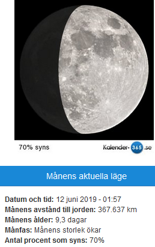
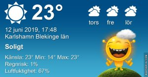

Idag går solen upp 04:13 och ned 21:48 Dagens längd är 17 timmar och 35 minuter. Det är gryning 03:11 och skymning 22:50 Det är dagsljus 19 timmar och 39 minuter. Månen går upp 15:29 och ned 02:28 Månen är belyst 70 %

 Molnigt och åska 14,1 C  Vindby 2,2 m/s S  Luftfuktighet 91 %  hPa 1011 Kl.01:55

 Molnigt 15,2 C  Vindby 0,8 m/s NW  Luftfuktighet 92 %  hPa 1011 Regn 0,8 mm Kl.07:30

 Mest molnigt 25,3 C  Vindby 3,8 m/s ENE  Luftfuktighet 71 %  hPa 1008 Kl.13:50

 Molnigt 17,1 C  Vindby 2,4 m/s WNW  Luftfuktighet 85 %  hPa 1005  Regn 1 mm Kl.19:55

 

 Inatt var det blixt och dunder igen! Min mätare registrerade över 90 blixtar på en halvtimme. Och så höll det på från midnatt till sju på morgonen.

 

Högst och lägst uppmätta temperatur igår (inofficiellt privat mätare) Max 29,7 ( i solen ) , Min 11,2 C Högst uppmätta vind 3,1 m/s, Högst uppmätta vindby 6,8 m/s

Högst och lägst uppmätta temperatur igår (officiellt enligt [YR.NO](http://www.vackertvader.se/v%C3%A4derstation/karlshamn?utm_source=email&utm_medium=email&utm_campaign=asarum)) Max 22,3 C, Min 13,2 C Högst uppmätta vind 3,2 m/s. Högst uppmätta vindby 9,3 m/s

 

## _**Osamarbetsvilliga fåglar, mörka moln och herr och fru Fasan som ställde upp på bild idag**_

 

\[gallery type="rectangular" size="large" link="file" ids="29871,29872,29873,29874,29875,29876,29877,29878,29879,29880"\]

 Inatt var det inte så lätt att ta bilder när blixtarna for runt på himlen och åskan dundrade. När sen regnet öste ner under några minuter blev det inte lättare. Men på slutet fick jag några bilder på mer eller mindre samarbetsvilliga objekt 👍😊
