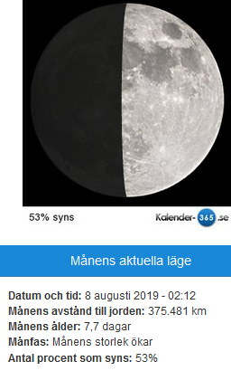

Idag går solen upp 04:29 och ned 21:42 Dagens längd är 17 timmar och 13 minuter. Det är gryning 03:31 och skymning 22:40 Det är dagsljus 19 timmar och 09 minuter. Månen går upp 17:20 och ned 01:28 Månen är belyst 76 %

 Mest molnigt 10,4 C  Vindstilla  Luftfuktighet 92 %  hPa 1006 Kl.01:25

 Delvis molnigt 16,2 C   Vindby 0,3 m/s SW  Luftfuktighet 73 %  hPa 1006 Kl.06:45

 Tunna moln 32,2 C  Vindby 3,1 m/s N  Luftfuktighet 39 %  hPa 1006 Kl.13:45

 Ökande molnighet 18,7 C  Vindby 0,3 m/s W  Luftfuktighet 61 %  hPa 1007 Kl.20:00

 Ännu en varm dag och imorgon ska det bli åska om allt stämmer enligt prognoserna. Får väl se vad det blir av det!

Högst och lägst uppmätta temperatur igår (inofficiellt privat mätare) Max 32,3 ( i solen )  , Min 5,1 C Högst uppmätta vind 2 m/s, Högst uppmätta vindby 3,4 m/s

Högst och lägst uppmätta temperatur igår (officiellt enligt [YR.NO](http://www.vackertvader.se/v%C3%A4derstation/karlshamn?utm_source=email&utm_medium=email&utm_campaign=asarum)) Max 23,3 C, Min 5,1 C Högst uppmätta vind 3 m/s. Högst uppmätta vindby 6,5 m/s

Ikväll var vi på Diggiloo och tiden räcker inte till för mer än den här bilden med en liten klurig fråga. Man kan ju undra vad de egentligen tycker hahaha.
