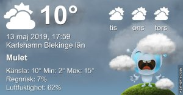

Idag går solen upp 04:51 och ned 21:04 Dagens längd är 16 timmar och 13 minuter. Det är gryning 04:02 och skymning 21:53 Det är dagsljus 17 timmar och 51 minuter. Månen går upp 13:29 och ned 03:24 Månen är belyst 61 %

 Växlande molnighet 1,8 C  Vindstilla  Luftfuktighet 82 %  hPa 1027 Kl.02:15

 Klart 11,8 C  Vindby 1,4 m/s SE  Luftfuktighet 52 %  hPa 1028 Kl.07:35

 Växlande molnighet 18,6 C  Vindby 3,6 m/s NNW  Luftfuktighet 19 %  hPa 1028 Kl.13:50

 En del tunna moln 8,2 C  Vindby 1 m/s S  Luftfuktighet 53 %  hPa 1030 Kl.20:05

 Idag har det inte alls varit varmt och inatt ska det bli frysgrader igen!

 

Högst och lägst uppmätta temperatur igår (inofficiellt privat mätare) Max 20,8 , Min - 0,7 C Högst uppmätta vind 4,1 m/s, Högst uppmätta vindby 7,8 m/s

Högst och lägst uppmätta temperatur igår (officiellt enligt [YR.NO](http://www.vackertvader.se/v%C3%A4derstation/karlshamn?utm_source=email&utm_medium=email&utm_campaign=asarum)) Max 14,4 C, Min 1,6 C Högst uppmätta vind 4,8 m/s. Högst uppmätta vindby 10,8 m/s

\[gallery type="rectangular" link="file" size="large" ids="28672,28673,28674,28675,28676,28677,28678,28679,28680,28681,28682,28683,28684,28685,28686,28687"\]

Nu har vi lämnat Los Angeles och påbörjat vår bussresa runt Kalifornien, Arizona och Nevada. Ett av de första stoppen blir vid Solvang, en liten bit av Danmark mitt ute på vischan. En riktigt mysig liten by med dansk stil på husen. Det var riktigt skönt att komma ut på landet och lämna storstadsbruset bakom sig ett tag.
