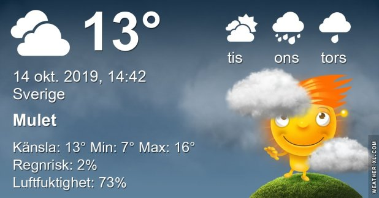

## Måndag 14 Oktober

I dag gryr dagen i Asarum 06:51. Solen går upp klockan 07:29 och ner klockan 18:03 . Det mörknar vid 18:41. Dagens längd är 10 timmar och 34 minuter. Det är dagsljus 11 timmar och 50 minuter. Månen går upp 18:50 och ned 07:32 Månen är belyst 100 %

I Asarum blir dagen 4 minuter och 37 sekunder kortare. Dagen har blivit 7 timmar och 6 minuter kortare sedan sommarsolståndet. Vintersolstånd om 69 dagar.

Missa inte gyllene timmen som börjar klockan 17:13 i Asarum. Då står solen lågt och kastar ett fint gyllene ljus

 

 Molnigt 12,6 C  Vindby 0,3 m/s SW  Luftfuktighet 97 %  hPa 999 Kl.02:00

 Mest molnigt 13,2 C  Vindby 2 m/s NE  Luftfuktighet 85 %  hPa 1000 Kl.06:25

 Mest molnigt och blåsigt 14,7 C  Vindby 4,8 m/s E  Luftfuktighet 62 %  hPa 1007  Regn 0,5 mm Kl.14:40

 Mest molnigt 9,2 C  Vindstilla  Luftfuktighet 77 %  hPa 1011 Kl.19:55

 Idag har det varit blåsigt och inatt ösregn och åska till och med!

Högst och lägst uppmätta temperatur igår (inofficiellt privat mätare) Max 17,9, Min 6,9 C Högst uppmätta vind 2,4 m/s, Högst uppmätta vindby 3,7 m/s

Högst och lägst uppmätta temperatur igår (officiellt enligt [YR.NO](http://www.vackertvader.se/v%C3%A4derstation/karlshamn?utm_source=email&utm_medium=email&utm_campaign=asarum)) Max 14,1 C, Min 6,1 C Högst uppmätta vind 4,4 m/s. Högst uppmätta vindby 8,9  m/s

## _**Höstrusk i skogen**_

\[gallery type="rectangular" link="file" size="large" ids="32489,32490,32491,32492,32493"\]
