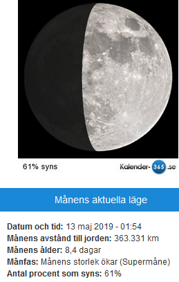

Idag går solen upp 07:29 och ned 17:01 Dagens längd är 9 timmar och 32 minuter. Det är gryning 06:50 och skymning 17:40 Det är dagsljus 10 timmar och 50 minuter. Månen går upp 11:17 och ned 02:44 Månen är belyst 62 %

 Molnigt 5 C  Vindby 3,8 m/s SSW  Luftfuktighet 83 %  hPa 1023 Kl.02:15

 Molnigt 5,6 C  Vindby 1,2 m/s ENE  Luftfuktighet 86 %  hPa 1024 Kl.06:40

 Molnigt 8,1 C  Vindby 2,4 m/s S  Luftfuktighet 78 %  hPa 1025 Kl.14:45

 Molnigt 4,6 C  Vindby 4,6 m/s ESE  Luftfuktighet 81 %  hPa 1025 Kl.19:55

 Efter en dag med sol och vårväder är det gråa tillbaks igen. Men det är varmt och skönt ändå.

Högst och lägst uppmätta temperatur igår (inofficiellt privat mätare) Max 13,3 ( i solen ) C , Min 0,8 C Högst uppmätta vind 4,8 m/s, Högst uppmätta vindby 8,2 m/s

Högst och lägst uppmätta temperatur igår (officiellt enligt [YR.NO](http://www.vackertvader.se/v%C3%A4derstation/karlshamn?utm_source=email&utm_medium=email&utm_campaign=asarum)) Max 9,8 C, Min  1,3 C Högst uppmätta vind 4,6 m/s. Högst uppmätta vindby 12,9 m/s

\[gallery type="rectangular" link="file" size="large" ids="27249,27250,27251,27252,27253,27254,27255,27256,27257,27258,27259,27260" orderby="rand"\]

Här är vår andra levadapromenad på Madeira som var allt annat är lätt att gå. Rabacal med vattenfall och så vacker natur.
