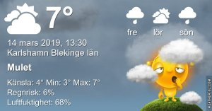

Idag går solen upp 06:20 och ned 18:01 Dagens längd är 11 timmar och 41 minuter. Det är gryning 05:43 och skymning 18:38 Det är dagsljus 12 timmar och 55 minuter. Månen går upp 09:52 och ned 01:39 Månen är belyst 46 %

 Molnigt 4 C  Vindby 1,7 m/s NE  Luftfuktighet 91 %  hPa 987 Kl.02:05

 Regn 3,7 C  Vindby 1 m/s ENE  Luftfuktighet 93 %  hPa 987  Regn 0,5 mm Kl.06:50

 Molnigt 11,1 C  Vindby 1,8 m/s E  Luftfuktighet 62 %  hPa 987  Regn 1,2 mm Kl.13:25

 Molnigt 3,3 C  Vindby 1,6 m/s E  Luftfuktighet 92 %  hPa 986  Regn 1,7 mm Kl.20:00

 Grått och regn men också någon liten solglimt däremellan.

Högst och lägst uppmätta temperatur igår (inofficiellt privat mätare) Max 7,7 , Min 2,2 C Högst uppmätta vind 3,4 m/s, Högst uppmätta vindby 6,1 m/s

Högst och lägst uppmätta temperatur igår (officiellt enligt [YR.NO](http://www.vackertvader.se/v%C3%A4derstation/karlshamn?utm_source=email&utm_medium=email&utm_campaign=asarum)) Max 5,8 C, Min 2,7 C Högst uppmätta vind 3,9 m/s. Högst uppmätta vindby 9,7 m/s

 Läste den här otroliga historien och kan inte annat än undra hur man kan lyckas med detta? Glömma sitt barn och inte märka det förrän man är i luften och på väg?

 Dagens väder var regn, blåst och lite sol emellanåt.
