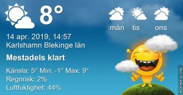

Idag går solen upp 05:58 och ned 20:05 Dagens längd är 14 timmar och 07 minuter. Det är gryning 05:18 och skymning 20:45 Det är dagsljus 15 timmar och 27 minuter. Månen går upp 12:56 och ned 04:23 Månen är belyst 63 %

 Klart - 2,6 C  Vindby 1,6 m/s WNW  Luftfuktighet 71 %  hPa 1027 Kl.01:30

 Växlande molnighet 1,5 C  Vindby 1 m/s N  Luftfuktighet 76 %  hPa 1027 Kl.07:00

 Växlande molnighet 13,2 C  Vindby 5,6 m/s E  Luftfuktighet 31 %  hPa 1028 Kl.13:40

 Tunna slöjmoln 3,8 C  Vindby 4,4 m/s ENE  Luftfuktighet 42 %  hPa 1029 Kl.19:55

 Soligt men ingen överdriven värme idag.

Högst och lägst uppmätta temperatur igår (inofficiellt privat mätare) Max 8,2 , Min – 5,7 C Högst uppmätta vind 3,4 m/s, Högst uppmätta vindby 5,4 m/s

Högst och lägst uppmätta temperatur igår (officiellt enligt [YR.NO](http://www.vackertvader.se/v%C3%A4derstation/karlshamn?utm_source=email&utm_medium=email&utm_campaign=asarum)) Max 5,8 C, Min – 6 C Högst uppmätta vind 3,6 m/s. Högst uppmätta vindby 10,3 m/s

 Den här talar för sig själv!

 Ett användbart ord för en procrastinator!

 Och vem kan motstå det här självsäkra lilla charmtrollet?
