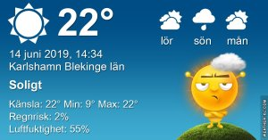

Idag går solen upp 04:12 och ned 21:49 Dagens längd är 17 timmar och 37 minuter. Det är gryning 03:10 och skymning 22:52 Det är dagsljus 19 timmar och 42 minuter. Månen går upp 18:14 och ned 03:01 Månen är belyst 87 %

 

 Mest klart 9,4 C  Vindstilla  Luftfuktighet 94 %  hPa 1012 Kl.01:15

 Mest klart 24,5 C  Vindby 1,2 m/s SW  Luftfuktighet 52 %  hPa 1014 Kl.07:55

 Mest klart 27,6 C  Vindby 2 m/s E  Luftfuktighet 40 %  hPa 1016 Kl.14:10

 Mest klart17,2 C  Vindby 0,3 m/s NW  Luftfuktighet 61 %  hPa 1016 Kl.20:15

 

 Torrt och varmt. Ger snart upp hoppet om ett ordentligt regn som gör nytta ☹

 

Högst och lägst uppmätta temperatur igår (inofficiellt privat mätare) Max 28,5 ( i solen )  , Min 13,1 C Högst uppmätta vind 2 m/s, Högst uppmätta vindby 3,4 m/s

Högst och lägst uppmätta temperatur igår (officiellt enligt [YR.NO](http://www.vackertvader.se/v%C3%A4derstation/karlshamn?utm_source=email&utm_medium=email&utm_campaign=asarum)) Max 23,6 C, Min 8,9 C Högst uppmätta vind 3,1 m/s. Högst uppmätta vindby 6,5 m/s

 

## _**Soluppgång, Tofsvipa och svårfotad svanfamilj**_

 

\[gallery type="rectangular" link="file" size="large" ids="29917,29918,29919,29920,29921"\]

Några bilder från min morgonrunda. Jag har inte sett de små tofsviporna på några dagar och jag hoppas inget har hänt dem 😢
