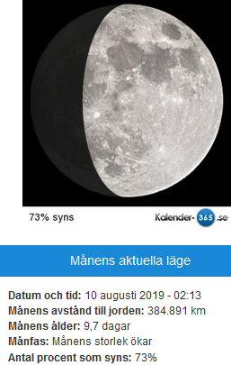
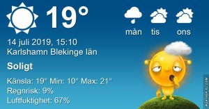

Idag går solen upp 04:32 och ned 21:40 Dagens längd är 17 timmar och 08 minuter. Det är gryning 03:35 och skymning 22:36 Det är dagsljus 19 timmar och 01 minuter. Månen går upp 19:46 och ned 02:20 Månen är belyst 91 %

Halvklart 20,4 C  Vindby 0,3 m/s W  Luftfuktighet 98 %  hPa 1009 Kl.01:30

 Tunna moln 23 C  Vindby 0,3 m/s SW  Luftfuktighet 68 %  hPa 1010 Kl.07:30

 Växlande molnighet 29,4 C  Vindby 3,6 m/s SW  Luftfuktighet 46 %  hPa 1010 Kl.13:30

 Molnigt 19,5 C  Vindby 0,3 m/s W  Luftfuktighet 67 %  hPa 1010 Kl.19:40

 Varmt och svårt att sova. Det är hur det har varit senaste dagarna!

Högst och lägst uppmätta temperatur igår (inofficiellt privat mätare) Max 27,6 ( i solen )  , Min 11,8 C Högst uppmätta vind 3,4 m/s, Högst uppmätta vindby 4,8 m/s

Högst och lägst uppmätta temperatur igår (officiellt enligt [YR.NO](http://www.vackertvader.se/v%C3%A4derstation/karlshamn?utm_source=email&utm_medium=email&utm_campaign=asarum)) Max 23,2 C, Min 10,4 C Högst uppmätta vind 3 m/s. Högst uppmätta vindby 8,1 m/s

 

## _**Så här känner jag just nu!**_

 Semestern är slut och nu väntar en lång och dryg höst!
