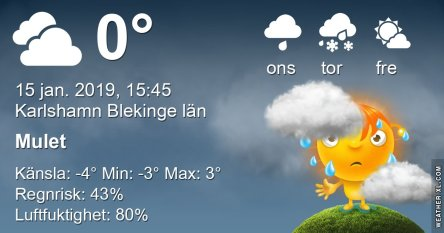
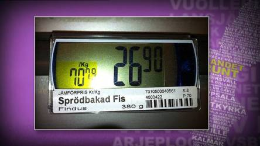
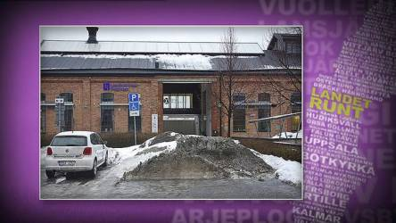

Idag går solen upp 08:23 och ned 15:57 Dagens längd är 7 timmar och 34 minuter. Det är gryning 07:38 och skymning 16:42 Det är dagsljus 9 timmar och 4 minuter. Månen går upp 12:00 och ned 01:10 Månen är belyst 57 %.

 Mest klart - 1,9 C  Vindby 3,4 m/s NE  Luftfuktighet 51 %  hPa 996 Kl.01:15

 Klart - 2,7 C  Vindby 2,8 m/s SSE  Luftfuktighet 46 %  hPa 997 Kl.06:20

Snö 0,2 C  Vindby 1,4 m/s N  Luftfuktighet 75 %  hPa 995 Kl.13:40

Växlande molnighet 1,3 C  Vindby 2,8 m/s WSW  Luftfuktighet 85 %  hPa 992  Regn 0,5 mm Kl.21:05

 Snö nästan hela dagen, med snöblandat emellanåt.

Högst och lägst uppmätta temperatur igår (inofficiellt privat mätare) Max 3,4 C , Min - 3,6 C Högst uppmätta vind 5,1 m/s, Högst uppmätta vindby 7,8 m/s

Högst och lägst uppmätta temperatur igår (officiellt enligt [YR.NO](http://www.vackertvader.se/v%C3%A4derstation/karlshamn?utm_source=email&utm_medium=email&utm_campaign=asarum)) Max 1,2 C, Min - 1,8 C Högst uppmätta vind 5,5 m/s. Högst uppmätta vindby 14,2 m/s

Hittade lite roliga skyltar från landet runt. Här är några av dem. Fler kommer imorgon.

Så det är här man hamnar i framtiden

Ser gott ut. Men var är skinkan?

Det gäller att man har bantat här.

 Tror jag avstår!

Jaha! Hur var det tänkt här då?

 Hm, säger inte det sig själv? Eller?

 Undrar vad de hittat på?

 Någon som kan få ihop det här till något vettigt? Verkar finnas en viss bestlutsångest här.

 De verkar vara i behov av det.

 Bra att veta!

 Det gäller att hinna dit innan söndag då!

 Oj då, den krympte visst!
