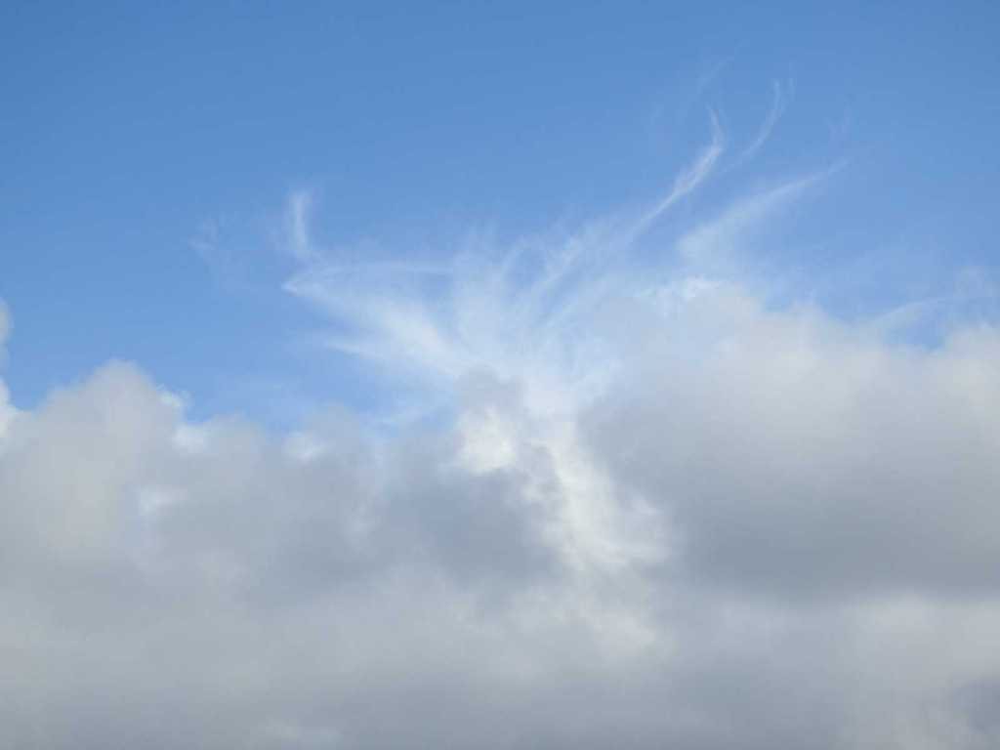

Idag går solen upp 07:27 och ned 17:03 Dagens längd är 9 timmar och 36 minuter. Det är gryning 06:48 och skymning 17:42 Det är dagsljus 10 timmar och 54 minuter. Månen går upp 11:58 och ned 03:59 Månen är belyst 72 %

 Molnigt 4,5C  Vindby 1,6 m/s ENE  Luftfuktighet 81 %  hPa 1025 Kl.02:20

 Molnigt 5,1 C  Vindby 2 m/s S  Luftfuktighet 84 %  hPa 1025 Kl.06:40

 Halvklart 14,2 C  Vindby 1,4 m/s E  Luftfuktighet 47 %  hPa 1024 Kl.14:55

 Klart - 1 C  Vindby 0,3 m/s NW  Luftfuktighet 76 %  hPa 1023 Kl.20:00

Högst och lägst uppmätta temperatur igår (inofficiellt privat mätare) Max 8,4 C , Min 4,6 C Högst uppmätta vind 3,4 m/s, Högst uppmätta vindby 6,1 m/s

Högst och lägst uppmätta temperatur igår (officiellt enligt [YR.NO](http://www.vackertvader.se/v%C3%A4derstation/karlshamn?utm_source=email&utm_medium=email&utm_campaign=asarum)) Max 7,5 C, Min  3,5 C Högst uppmätta vind 3,1 m/s. Högst uppmätta vindby 8,6 m/s

\[gallery type="rectangular" link="file" size="large" ids="27272,27273,27274,27275,27276,27278"\]

Lite blandade bilder från Funchal på Madeira.

 Är det någon som ser den vackra kronhjorten i skyn?
