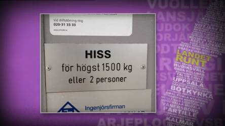
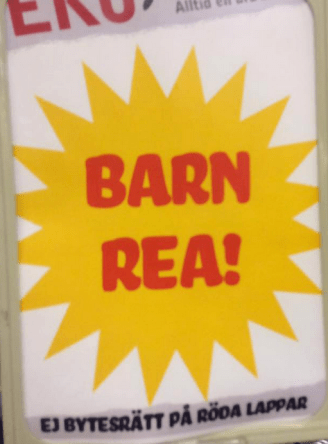

Idag går solen upp 08:22 och ned 15:59 Dagens längd är 7 timmar och 37 minuter. Det är gryning 07:37 och skymning 16:44 Det är dagsljus 9 timmar och 7 minuter. Månen går upp 12:21 och ned 02:29 Månen är belyst 68 %.

 Växlande molnighet - 1,6 C  Vindby 0,7 m/s SE  Luftfuktighet 85 %  hPa 995 Kl.02:00 Molnigt och bitvis dimma - 1,7 C  Vindstilla  Luftfuktighet 87 %  hPa 995 Kl.06:35

 Molnigt 6,3 C  Vindby 2 m/s SSE  Luftfuktighet 87 %  hPa 992  Regn 2,7 mm Kl.14:20

 Molnigt 5,9 C  Vindby 3 m/s NNW  Luftfuktighet 84 %  hPa 988  Regn 3,2 mm Kl.20:10

Högst och lägst uppmätta temperatur igår (inofficiellt privat mätare) Max 4,5 C , Min – 5,1 C Högst uppmätta vind 2,4 m/s, Högst uppmätta vindby 4,8 m/s

Högst och lägst uppmätta temperatur igår (officiellt enligt [YR.NO](http://www.vackertvader.se/v%C3%A4derstation/karlshamn?utm_source=email&utm_medium=email&utm_campaign=asarum)) Max 3,2 C, Min – 4,5 C Högst uppmätta vind 3,4 m/s. Högst uppmätta vindby 9,4 m/s

Här kommer fler skyltar från Landet runt.

 Det är ju en klar fördel. Att de inte fastnar. Eller?

 Nähä! Det menar de inte!

 När började sesamfrön klassas som kräftdjur?

 Ok, den ska ju ändå bli papper en vacker dag.

 Wow! Jag visste inte att vi redan fått kontakt. Onekligen spännande.

 Kanske läge att fundera på att banta här.

 Känns lite osäkert. Men det kanske funkar.

 Vilket tillfälle. Synd dock att bytesrätten inte gäller. Men man kan ju inte få allt.

 Själv nöjer jag mig med en make-up remover. Ögat vill jag gärna behålla.

 Billigt och bra!

 De lär ju inte kunna säga så mycket efter det smakprovet!
