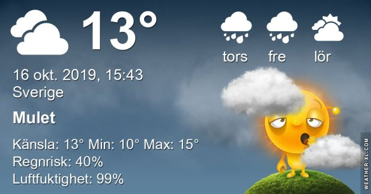

## Onsdag 16 Oktober

I dag gryr dagen i Asarum 06:55. Solen går upp klockan 07:33 och ner klockan 17:58 . Det mörknar vid 18:36. Dagens längd är 10 timmar och 25 minuter. Det är dagsljus 11 timmar och 41 minuter. Månen går upp 19:24 och ned 10:00 Månen är belyst 96 %

I Asarum blir dagen 4 minuter och 33 sekunder kortare. Dagen har blivit 7 timmar och 15 minuter kortare sedan sommarsolståndet. Vintersolstånd om 67 dagar.

Missa inte gyllene timmen som börjar klockan 17:08 i Asarum. Då står solen lågt och kastar ett fint gyllene ljus

 

 Molnigt 10,4 C  Vindby 1,6 m/s E  Luftfuktighet 93 %  hPa 1002 Kl.01:30

 Dis och dimma 10,4 C  Vindby 0,4 m/s NW  Luftfuktighet 96 %  hPa 1000 Kl.07:25

 Molnigt 14,1 C  Vindby 1 m/s W  Luftfuktighet 91 %  hPa 999 Kl.14:30

 

 Molnigt och duggregn 11,4 C  Vindby 0,7 m/s SE  Luftfuktighet 94 %  hPa 1000 Kl.21:45

Grått och disigt hela dagen!

Högst och lägst uppmätta temperatur igår (inofficiellt privat mätare) Max 18,5, Min 7,1 C Högst uppmätta vind 2,4 m/s, Högst uppmätta vindby 4,8 m/s

Högst och lägst uppmätta temperatur igår (officiellt enligt [YR.NO](http://www.vackertvader.se/v%C3%A4derstation/karlshamn?utm_source=email&utm_medium=email&utm_campaign=asarum)) Max 15,8 C, Min 8,7 C Högst uppmätta vind 4,9 m/s. Högst uppmätta vindby 9,8  m/s

 

## _**Behöver lite färg och värme...**_

så jag bläddrade i gamla mappar och hamnade i Paris och Disney World. Lite minnen från en härlig dag där kommer här!

\[gallery type="rectangular" link="file" size="large" ids="32534,32535,32536,32537,32538,32539,32540,32541,32542,32543,32544"\]
