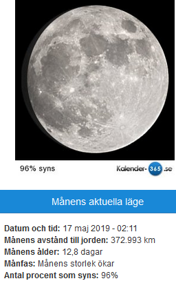
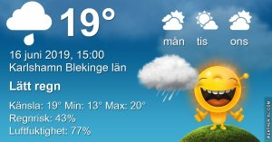
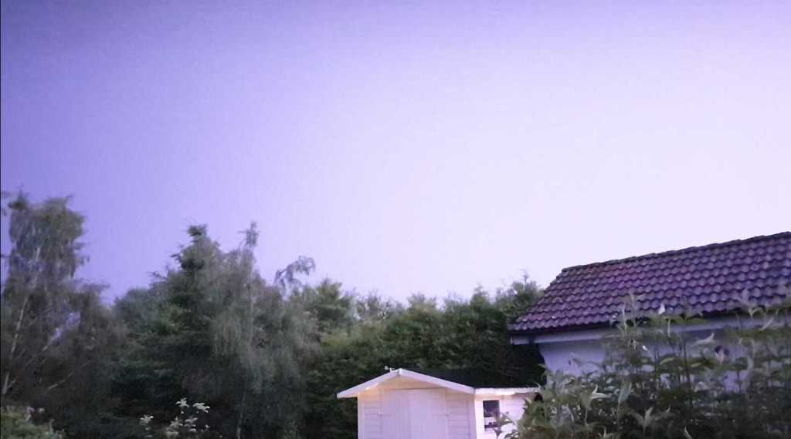
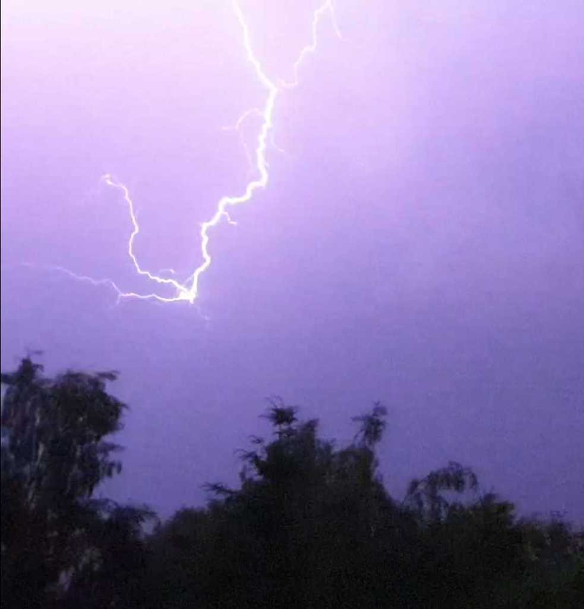

Idag går solen upp 04:12 och ned 21:50 Dagens längd är 17 timmar och 38 minuter. Det är gryning 03:09 och skymning 22:54 Det är dagsljus 19 timmar och 45 minuter. Månen går upp 20:50 och ned 03:47 Månen är belyst 98 %

 Molnigt 13 C  Vindby 0,7 m/s W  Luftfuktighet 95 %  hPa 1009 Kl.01:30

 Mest molnigt 17,7 C  Vindby 0,3 m/s E  Luftfuktighet 88 %  hPa 1009 KL.07:00

 Molnigt 24,8 C  Vindby 2,4 m/s E  Luftfuktighet 70 %  hPa 1012 Kl.14:25

 Växlande molnighet 19,2 C  Vindby 2 m/s WSW  Luftfuktighet 69 %  hPa 1013 Kl.20:05

 

 Lite svalare idag men inget regn ännu!

 

Högst och lägst uppmätta temperatur igår (inofficiellt privat mätare) Max 26,9 , Min 8,8 C Högst uppmätta vind 3,1 m/s, Högst uppmätta vindby 7,5 m/s

Högst och lägst uppmätta temperatur igår (officiellt enligt [YR.NO](http://www.vackertvader.se/v%C3%A4derstation/karlshamn?utm_source=email&utm_medium=email&utm_campaign=asarum)) Max 23,9 C, Min 8,1 C Högst uppmätta vind 6,6 m/s. Högst uppmätta vindby 13,6 m/s

 

## _**Tidig lördagsmorgon**_

 

\[gallery type="rectangular" link="file" size="large" ids="29953,29954,29955,29956,29957,29958,29959,29960"\]

Några bilder från igår på min runda. Det blev en dragkamp mellan solen och molnen och till slut fick de dela lika och turas om.

 

## _**Blixt och dunder**_

 

 Jag lyckades fånga några blixtar på bild när det åskade som värst här. Överst är en av dem och underst visar hur mycket den lyste upp. Det blev ljust som mitt på dagen!

 Ytterligare en blixt och hur mycket den lyste upp. Ett fantastiskt skådespel av moder natur! Så vackert men också så respektingivande!
