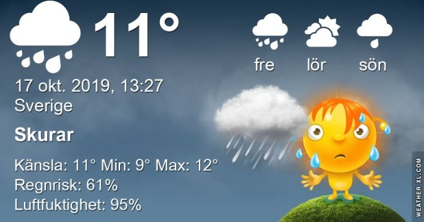

## Torsdag 17 Oktober

I dag gryr dagen i Asarum 06:57. Solen går upp klockan 07:35 och ner klockan 17:56 . Det mörknar vid 18:33. Dagens längd är 10 timmar och 21 minuter. Det är dagsljus 11 timmar och 36 minuter. Månen går upp 19:47 och ned 11:15 Månen är belyst 91 %

I Asarum blir dagen 4 minuter och 37 sekunder kortare. Dagen har blivit 7 timmar och 20 minuter kortare sedan sommarsolståndet. Vintersolstånd om 66 dagar.

Missa inte gyllene timmen som börjar klockan 17:05 i Asarum. Då står solen lågt och kastar ett fint gyllene ljus

 

 Molnigt 11,6 C  Vindby 1,7 m/s E  Luftfuktighet 95 %  hPa 1002 Kl.02:10

 Molnigt 9,9 C  Vindstilla  Luftfuktighet 95 %  hPa 1003 Kl.07:15

 Lätt regn 13,8 C  Vindby 1,4 m/s E  Luftfuktighet 90 %  hPa 1005  Regn 0,7 mm Kl.13:30

 Molnigt 12,2 C  Vindby 1,2 m/s S  Luftfuktighet 95 %  hPa 1006  Regn 1,2 mm Kl.19:55

 Grått och duggregn och milt är dagens väder

Högst och lägst uppmätta temperatur igår (inofficiellt privat mätare) Max 14,1, Min 10,3 C Högst uppmätta vind 1,4 m/s, Högst uppmätta vindby 1,7 m/s

Högst och lägst uppmätta temperatur igår (officiellt enligt [YR.NO](http://www.vackertvader.se/v%C3%A4derstation/karlshamn?utm_source=email&utm_medium=email&utm_campaign=asarum)) Max 12,5 C, Min 10,4 C Högst uppmätta vind 1,7 m/s. Högst uppmätta vindby 4,5  m/s

## _**Johannes och Joe**_

i ivrigt samtal om kvällens föreställning igår!

\[gallery type="rectangular" link="file" size="large" ids="32554,32555,32556,32557,32558,32559,32560,32561,32562"\]
