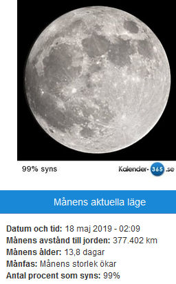
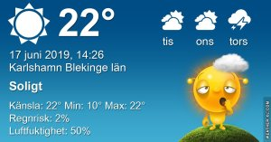

Idag går solen upp 04:12 och ned 21:51 Dagens längd är 17 timmar och 39 minuter. Det är gryning 03:09 och skymning 22:54 Det är dagsljus 19 timmar och 45 minuter. Månen går upp 21:58 och ned 04:19 Månen är belyst 100 %

 

 Tunna moln 11,1 C  Vindby 0,3 m/s SW  Luftfuktighet 89 %  hPa 1015 Kl.01:35

 Halvklart 19,3 C  Vindby 0,7 m/s NW  Luftfuktighet 59 %  hPa 1016 Kl.07:00

 Växlande molnighet 28,7 C  Vindby 3,8 m/s NNW  Luftfuktighet 39 %  hPa 1016 Kl.13:45

 Halvklart 20,6 C  Vindby 1,4 m/s S  Luftfuktighet 49 %  hPa 1015 Kl.20:05

 

 Tröttsamt torrt och varmt. Och inte blir det mindre torrt av att det blåser varje dag heller!

 

Högst och lägst uppmätta temperatur igår (inofficiellt privat mätare) Max 25,3 ( i solen )  , Min 12,8 C Högst uppmätta vind 2,4 m/s, Högst uppmätta vindby 4,4 m/s

Högst och lägst uppmätta temperatur igår (officiellt enligt [YR.NO](http://www.vackertvader.se/v%C3%A4derstation/karlshamn?utm_source=email&utm_medium=email&utm_campaign=asarum)) Max 20,8 C, Min 13,2 C Högst uppmätta vind 4,4 m/s. Högst uppmätta vindby 9,4 m/s

 

## _**Blandade morgonbilder**_

 

\[gallery type="rectangular" link="file" size="large" ids="29974,29975,29976,29977,29978,29979,29980,29981,29982,29983,29984,29985,29986"\]

Idag var det ovanligt mycket djur som rörde sig kring vägarna på landet. Jag såg hur många rådjur som helst. Och en räv som jag tyvärr inte hann få någon bild på. Även två små jättesöta kaninungar, en svart och en brun, som jag inte heller hann få bild på. Rådjurskiden fick jag bara bakdelen med på bild, men man ser att de har kvar sina prickar. Jag hoppas att jag får syn på dem igen och att jag hinner ta bättre bilder på dem då.
