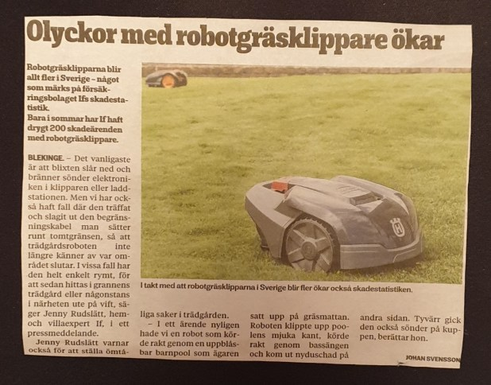
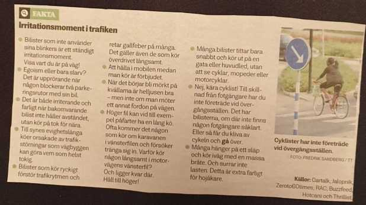

## Tisdag 17 September

I dag gryr dagen i Asarum 05:57. Solen går upp klockan 06:35 och ner klockan 19:14 . Det mörknar vid 19:52. Dagens längd är 12 timmar och 39 minuter. Det är dagsljus 13 timmar och 55 minuter. Månen går upp 20:44 och ned 09:43 Månen är belyst 93 %

I Asarum blir dagen 4 minuter och 40 sekunder kortare. Dagen har blivit 5 timmar och 1 minuter kortare sedan sommarsolståndet. Vintersolstånd om 96 dagar.

Missa inte gyllene timmen som börjar klockan 18:27 i Asarum. Då står solen lågt och kastar ett fint gyllene ljus

 

 Mest klart 5,9 C  Vindby 0,3 m/s S  Luftfuktighet 96 %  hPa 1004 Kl.01:30

 Regnskurar 7,9 C  Vindby 1,2 m/s W  Luftfuktighet 98 %  hPa 1001  Regn 2,7 mm Kl.06:50

 Molnigt 9,1 C  Vindby 1 m/s NE  Luftfuktighet 92 %  hPa 998  Regn 7,2 mm Kl.14:50

 Lätt regn 5,3 C  Vindby 3,4 m/s SE  Luftfuktighet 94 %  hPa 1000  Regn 9,5 mm Kl.20:15

Regn och höstrusk idag. Temperaturen kom bara strax över 11 grader på dagen! Men det kommer en liten värmebölja igen fram emot helgen.

Högst och lägst uppmätta temperatur igår (inofficiellt privat mätare) Max 21,2 , Min 5,9 C Högst uppmätta vind 4,4 m/s, Högst uppmätta vindby 8,5 m/s

Högst och lägst uppmätta temperatur igår (officiellt enligt [YR.NO](http://www.vackertvader.se/v%C3%A4derstation/karlshamn?utm_source=email&utm_medium=email&utm_campaign=asarum)) Max 16,2 C, Min 6,8 C Högst uppmätta vind 5,1 m/s. Högst uppmätta vindby 12,2 m/s

 

## _**Klipp från verkliga världen**_

Tänk så tokigt det kan bli ibland 😂🤣

