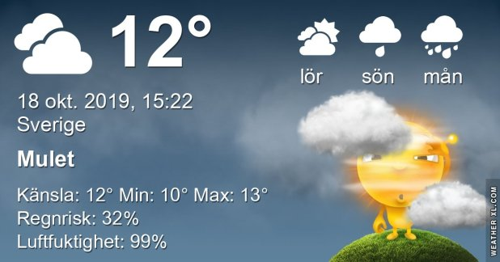

## Fredag 18 Oktober

I dag gryr dagen i Asarum 06:59. Solen går upp klockan 07:37 och ner klockan 17:53 . Det mörknar vid 18:31. Dagens längd är 10 timmar och 16 minuter. Det är dagsljus 11 timmar och 32 minuter. Månen går upp 20:19 och ned 12:28 Månen är belyst 84 %

I Asarum blir dagen 4 minuter och 32 sekunder kortare. Dagen har blivit 7 timmar och 24 minuter kortare sedan sommarsolståndet. Vintersolstånd om 65 dagar.

Missa inte gyllene timmen som börjar klockan 17:02 i Asarum. Då står solen lågt och kastar ett fint gyllene ljus

 Molnigt 10,4 C  Vindstilla  Luftfuktighet 96 %  hPa 1007 KL.01:45

 Dimma 11,4 C  Vindstilla  Luftfuktighet 96 %  hPa 1005 KL.07:45

 Molnigt och disigt 13,7 C  Vindby 1,6 m/s SSW  Luftfuktighet 97 %  hPa 1003  Regn 2,2 mm Kl.14:55

 Molnigt 12 C  Vindby 2,2 m/s S  Luftfuktighet 96 %  hPa 1001 Kl.19:50

Det började med tjock dimma och sen gråväder hela dagen.

Högst och lägst uppmätta temperatur igår (inofficiellt privat mätare) Max 14,4, Min 8,4 C Högst uppmätta vind 1 m/s, Högst uppmätta vindby 2 m/s

Högst och lägst uppmätta temperatur igår (officiellt enligt [YR.NO](http://www.vackertvader.se/v%C3%A4derstation/karlshamn?utm_source=email&utm_medium=email&utm_campaign=asarum)) Max 12,1 C, Min 9 C Högst uppmätta vind 2,6 m/s. Högst uppmätta vindby 5,4  m/s

## _**Tät dimma på morgonen**_

\[gallery type="rectangular" link="file" size="large" ids="32576,32577,32578,32579,32580,32581,32582,32583,32584,32585,32586,32587,32588,32589,32590,32591,32592"\]
