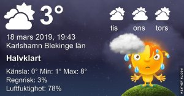

Idag går solen upp 06:09 och ned 18:09 Dagens längd är 12 timmar och 0 minuter. Det är gryning 05:32 och skymning 18:47 Det är dagsljus 13 timmar och 15 minuter. Månen går upp 14:20 och ned 05:23 Månen är belyst 87 %

 Molnigt 3,3 C  Vindby 5,4 m/s ENE  Luftfuktighet 77 %  hPa 989 Kl.02:15

 Molnigt 3 C  Vindby 5,2 m/s ENE  Luftfuktighet 73 %   hPa 989 Kl.06:40

 Växlande molnighet 10,1 C  Vindby 6,1 m/s NE  Luftfuktighet 59 %  hPa 993  Regn 0,5 mm Kl.13:40

 Mest molnigt 0,5 C  Vindby 2 m/s SW  Luftfuktighet 70 %  hPa 1002 Kl.19:50

 Blåsigt, regn, sol i en salig blandning!

Högst och lägst uppmätta temperatur igår (inofficiellt privat mätare) Max 11,1 , Min 1,9 C Högst uppmätta vind 5,1 m/s, Högst uppmätta vindby 11,2 m/s

Högst och lägst uppmätta temperatur igår (officiellt enligt [YR.NO](http://www.vackertvader.se/v%C3%A4derstation/karlshamn?utm_source=email&utm_medium=email&utm_campaign=asarum)) Max 8,7 C, Min 3,6 C Högst uppmätta vind 3,2 m/s. Högst uppmätta vindby 9,5 m/s

 Några fler av mina hemmaknåpade klokord!
