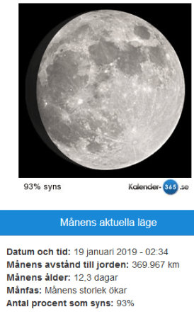

Idag går solen upp 08:18 och ned 16:05 Dagens längd är 7 timmar och 47 minuter. Det är gryning 07:34 och skymning 16:49 Det är dagsljus 9 timmar och 15 minuter. Månen går upp 14:13 och ned 06:23 Månen är belyst 93 %.

 Klart - 10 C  Vindstilla  Luftfuktighet 74 %  hPa 1011 Kl.02:20

 Mest klart - 10,7 C  Vindstilla  Luftfuktighet 74 %  hPa 1012 Kl.06:45

 Halvklart 2,9 C  Vindby 3,1 m/s SE  Luftfuktighet 72 %  hPa 1012 Kl.14:15

 Molnigt - 0,3 C  Vindby 2,4 m/s S  Luftfuktighet 82 %  hPa 1012 Kl.19:55

 Riktigt kallt och ruggigt nu. Minus 10 inatt!

Högst och lägst uppmätta temperatur igår (inofficiellt privat mätare) Max 3,5 C , Min – 8,2 C Högst uppmätta vind 2 m/s, Högst uppmätta vindby 3,4 m/s

Högst och lägst uppmätta temperatur igår (officiellt enligt [YR.NO](http://www.vackertvader.se/v%C3%A4derstation/karlshamn?utm_source=email&utm_medium=email&utm_campaign=asarum)) Max - 0,2 C, Min – 7,4 C Högst uppmätta vind 2,8 m/s. Högst uppmätta vindby 6,4 m/s

 

Här är några roliga och kanske någon tänkvärd men mest bara knasiga seriestrippar från morgontidningen. Tyvärr lite mörka en del eftersom jag tagit bilderna med mobilen.

