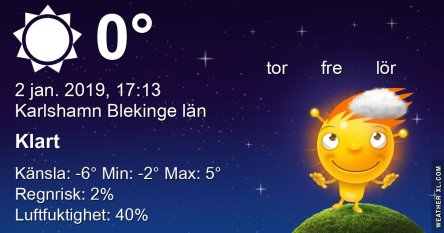

Idag går solen upp 08:33 och ned 15:36 Dagens längd är 7 timmar och 3 minuter. Det är gryning 07:46 och skymning 16:23 Det är dagsljus 8 timmar och 37 minuter. Månen går upp 04:41 och ned 13:28 Månen är belyst 15 %.

Växlande molnighet 1,6 C  Vindby 5 m/s W  Luftfuktighet 56 %  hPa 1005 Kl.02:25

 Blåsigt - 0,4 C  Vindby 9,9 m/s NW  Luftfuktighet 35 %  hPa 1012 Kl.06:45

 Mest klart 2,8 C  Vindby 8,2 m/s SW  Luftfuktighet 20 %  hPa 1019 kL.13:35

Klart - 2,7 C  Vindby 4 m/s SSE  Luftfuktighet 51 %  hPa 1024 Kl.19:50

 Idag har det varit riktigt blåsigt hela dygnet. Och nu blir det kallare igen.

Högst och lägst uppmätta temperatur igår (inofficiellt privat mätare) Max 8,4 C , Min 2,6 C Högst uppmätta vind 6,5 m/s, Högst uppmätta vindby 9,2 m/s

Högst och lägst uppmätta temperatur igår (officiellt enligt [YR.NO](http://www.vackertvader.se/v%C3%A4derstation/karlshamn?utm_source=email&utm_medium=email&utm_campaign=asarum)) Max 7,8 C, Min 3,7 C Högst uppmätta vind 6,3 m/s. Högst uppmätta vindby 18 m/s

\[gallery type="rectangular" link="file" size="large" ids="26215,26216,26217"\]

\[gallery type="circle" link="file" columns="2" size="full" ids="26212,26213,26214"\]

Tyvärr såg vi inte så många fåglar på Madeira men vi fick i alla fall se Madeirabofink, som bara finns på Madeira och även en strandpipare som jag inte har lyckats lista ut vilken sort det är. Vi såg en del andra fåglar också som vi inte fick så bra bilder på tyvärr.
