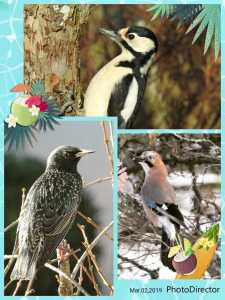
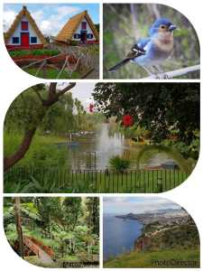
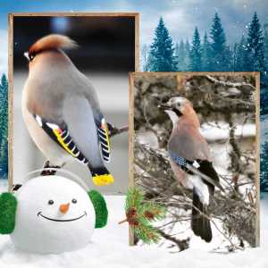

Idag går solen upp 06:51 och ned 17:36 Dagens längd är 10 timmar och 45 minuter. Det är gryning 06:13 och skymning 18:13 Det är dagsljus 12 timmar och 0 minuter. Månen går upp 05:29 och ned 12:52 Månen är belyst 18 %

 Ökande molnighet - 4,4 C  Vindby 0,3 m/s W  Luftfuktighet 90 %   hPa 1010 Kl.02:20

 Molnigt - 1,4 C  Vindby 1,7 m/s SE  Luftfuktighet 94 %  hPa 1009 Kl.06:45

 Växlande molnighet 9,2 C  Vindby 3,6 m/s SSW  Luftfuktighet 60 %  hPa 1007 Kl.13:15

 Molnigt 1,1 C  Vindby 1,4 m/s E  Luftfuktighet 78 %  hPa 1004 Kl.19:55

 Kallt och ruggigt!

Högst och lägst uppmätta temperatur igår (inofficiellt privat mätare) Max 12,6 ( i solen ) , Min – 6,3 C Högst uppmätta vind 1,4 m/s, Högst uppmätta vindby 2,4 m/s

Högst och lägst uppmätta temperatur igår (officiellt enligt [YR.NO](http://www.vackertvader.se/v%C3%A4derstation/karlshamn?utm_source=email&utm_medium=email&utm_campaign=asarum)) Max 5,7 C, Min – 5,7 C Högst uppmätta vind 0,6 m/s. Högst uppmätta vindby 4,7 m/s

 Idag har jag roat mig med att göra lite collage av äldre bilder i brist på annat.
