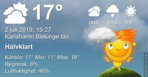
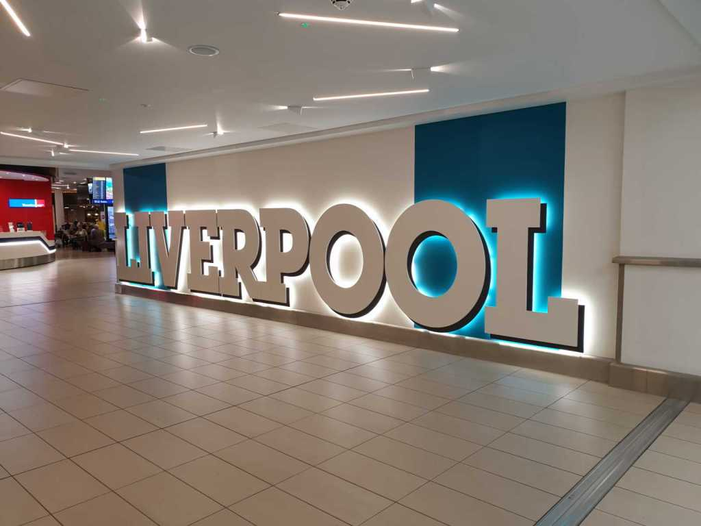

Idag går solen upp 04:18 och ned 21:50 Dagens längd är 17 timmar och 32 minuter. Det är gryning 03:16 och skymning 22:52 Det är dagsljus 19 timmar och 36 minuter. Månen går upp 04:06 och ned 21:22 Månen är belyst 1 %

 Växlande molnighet 13,6 C  Vindby 4,6 m/s W  Luftfuktighet 81 %  hPa 1003 Kl.01:35

 Växlande molnighet 14,8 C  Vindby 4,1 m/s E  Luftfuktighet 77 %  hPa 1003 Kl.07:20

 Växlande molnighet och blåsigt 23,1 C  Vindby 8,5 m/s SE  Luftfuktighet 43 %  hPa 1005 Kl.13:25

 Växlande molnighet 12 C  Vindby 2,4 m/s SE  Luftfuktighet 64 %   hPa 1009 Kl.21:00

 Äntligen lite svalare, men väldigt blåsigt!

Högst och lägst uppmätta temperatur igår (inofficiellt privat mätare) Max 25 ( i solen )  , Min 13,3 C Högst uppmätta vind 4,8 m/s, Högst uppmätta vindby 7,1 m/s

Högst och lägst uppmätta temperatur igår (officiellt enligt [YR.NO](http://www.vackertvader.se/v%C3%A4derstation/karlshamn?utm_source=email&utm_medium=email&utm_campaign=asarum)) Max 22,9 C, Min 14,5 C Högst uppmätta vind 4,2 m/s. Högst uppmätta vindby 14,9 m/s

 

## _**Tema Beatles Liverpool**_

 

 I helgen var vi i Liverpool för att se en konsert med Eagles, men som alla vet så är Liverpool lika med The Beatles. Så det blev många bilder på temat Beatles

## _**Beatles statyer**_

\[gallery type="rectangular" link="file" size="large" ids="30225,30228,30226,30227,30229,30232,30230,30231,30240,30241"\]

De välkända statyerna av Beatles är ett måste i Liverpool!

 

\[gallery type="rectangular" link="file" size="large" ids="30233,30236,30234,30235,30237,30238,30239"\]

Kanske inte lika välkända är de här statyerna på Hard Days Night hotellet, men väl värda att se ändå.
