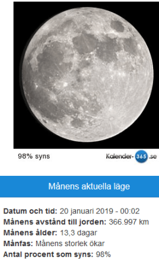

Idag går solen upp 08:17 och ned 16:07 Dagens längd är 7 timmar och 50 minuter. Det är gryning 07:33 och skymning 16:51 Det är dagsljus 9 timmar och 18 minuter. Månen går upp 15:19 och ned 07:30 Månen är belyst 98 %.

 Mest molnigt - 0,6 C  Vindby 2,4 m/s NE  Luftfuktighet 80 %  hPa 1012 Kl.00:50

Molnigt - 1,4 C  Vindby 2,4 m/s WSW  Luftfuktighet 83 %  hPa 1012 Kl.08:10

 Mest klart 2 C  Vindby 0,3 m/s S  Luftfuktighet 69 %  hPa 1014 Kl.13:50

 Mest klart - 6,2 C  Vindby 0,3 m/s SE   Luftfuktighet 80 %  hPa 1015  Regn/snö 0,7 mm Kl.19:45

 Usch! Plötsligt blev det vinter igen. Det snöar lappvantar.

Högst och lägst uppmätta temperatur igår (inofficiellt privat mätare) Max 4,7 C , Min – 10,8 C Högst uppmätta vind 3,1 m/s, Högst uppmätta vindby 4,1 m/s

Högst och lägst uppmätta temperatur igår (officiellt enligt [YR.NO](http://www.vackertvader.se/v%C3%A4derstation/karlshamn?utm_source=email&utm_medium=email&utm_campaign=asarum)) Max 2,4 C, Min – 9,4 C Högst uppmätta vind 2,4 m/s. Högst uppmätta vindby 5,3 m/s

\[gallery type="rectangular" link="file" size="large" ids="26768,26769,26770,26771,26772,26773,26774,26775,26776,26777,26778,26779,26780,26781,26782,26783,26784,26785,26786,26787,26788,26789,26790,26791,26792,26793,26794"\]

Idag var vi i Malmö och tittade på Disney on Ice för första gången. Det var väldigt trevligt och här är lite bilder från det. Tyvärr är de inte så skarpa eftersom de i stort sett aldrig var stilla.
