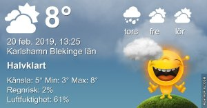

Idag går solen upp 07:15 och ned 17:14 Dagens längd är 9 timmar och 59 minuter. Det är gryning 06:37 och skymning 17:53 Det är dagsljus 11 timmar och 16 minuter. Månen går upp 18:29 och ned 07:55 Månen är belyst 100 %

 Lätt regn 2,7 C  Vindby 1,8 m/s ENE  Luftfuktighet 73 %  hPa 1003 Kl.02:20

 Mest molnigt 2,9 C  Vindby 3,1 m/s SE  Luftfuktighet 79 %  hPa 1005 Kl.07:00

 Växlande molnighet 12,7 C  Vindby 2,8 m/s NE  Luftfuktighet 49 %  hPa 1010  Regn 0,7 mm Kl.12:50

 Molnigt 0,1 C  Vindstilla  Luftfuktighet 75 %  hPa 1014 Kl.19:55

Soligt och fint på dagen men kallt på kvällen.

Högst och lägst uppmätta temperatur igår (inofficiellt privat mätare) Max 9,3 , Min - 2,1 C Högst uppmätta vind 4,4 m/s, Högst uppmätta vindby 8,8 m/s

Högst och lägst uppmätta temperatur igår (officiellt enligt [YR.NO](http://www.vackertvader.se/v%C3%A4derstation/karlshamn?utm_source=email&utm_medium=email&utm_campaign=asarum)) Max 6,8 C, Min – 1,6 C Högst uppmätta vind 3,2 m/s. Högst uppmätta vindby 10,8 m/s

\[gallery type="rectangular" link="file" size="full" ids="27367,27368,27369,27370,27373,27374"\]

Mer Minioner med mer eller mindre kloka ord.
